# 制作一艘基本舰船

*本节预期阅读时间：~15 分钟。*

*本节预期操作时间：~20 分钟。*

## 获取贴图

制作舰船首先需要一张贴图。

**编者并不擅长画图，但刚好也能展示获取贴图对于绝大多数人来说都不是一件困难的事情**。这里以一艘`锤头`与`斗士`的简单拼接为例，在使用`Photoshop`拼接之后做了一些简单画笔涂抹和颜色修正，耗时共计 16 秒，但最终效果已经勉强能看。

::: danger 特别注意！

贴图的宽与高**必须**都是 2 的倍数，否则游戏内会糊。

如无特殊要求，则贴图的周围仅上下左右各留至多 2 格透明像素，这可以节省提高内存占用。

*严格来说，宽与高不为 2 的倍数时有特殊方法让它不糊，但**应该总是 2 的倍数***。

:::

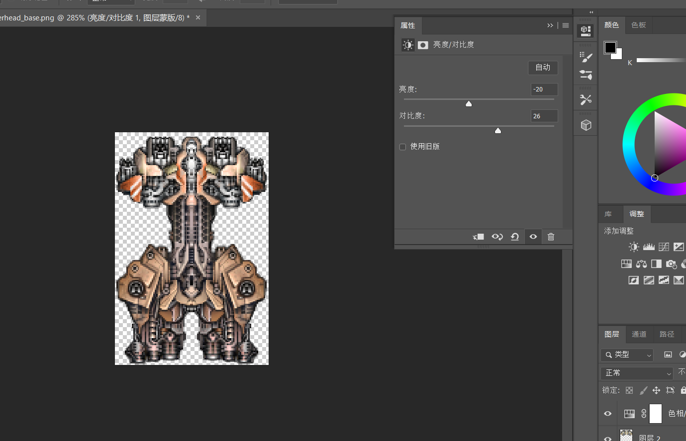

完成品如下，若您需要可以随意免费取用：

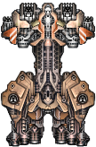

## 命名并将贴图放入正确的位置

::: tip 命名建议

对舰船进行命名时，**请有意避开已经存在的舰船名**，以便于您 MOD 的交流和推广。

若您希望制作一个整体的势力 MOD，**建议提前想好一整套命名风格**，来体现它的统一。

一味追求高端、玄奥、霸气等风格的名字可能会令其它玩家用户感到不适。

:::

您需要为舰船命名，想好它的**中文名称和英文名称**。在本例中，舰船被命名为`工匠-级(Artizan)`。

然后为它分配 ID，格式为：前缀名+舰船名。在本例中，舰船的 ID 是`GearIn_artizan`。

将贴图命名为舰船 ID 相同。在本例中，贴图文件名为`GearIn_artizan.png`

最后放入对应贴图文件夹(`graphics/ships`)：

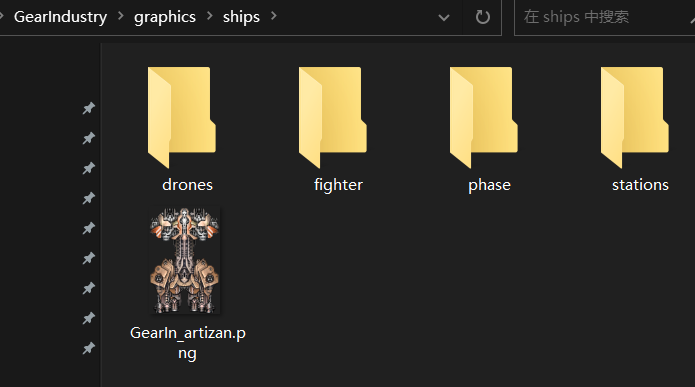

## 制作舰船文件

打开此前您下载的舰船编辑器，选择游戏目录。

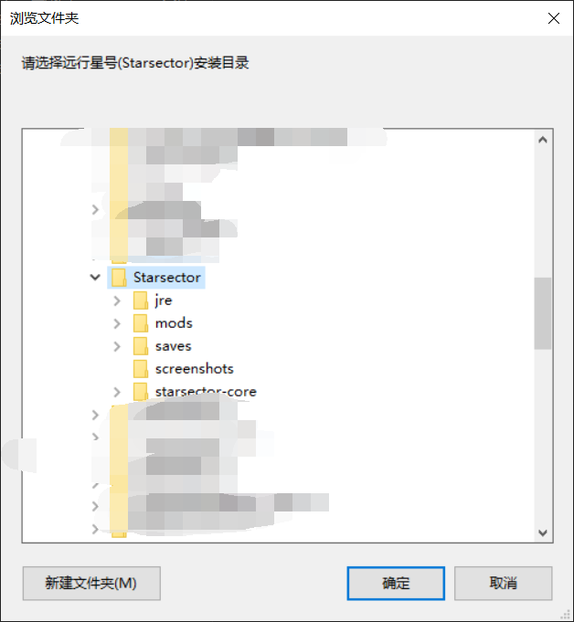

### 开始制作

::: tip 记得多保存

制作过程中记得多保存，以防闪退。

:::

制作舰船文件的流程十分明确：**导入贴图，然后从按键 C 开始一路向下**。

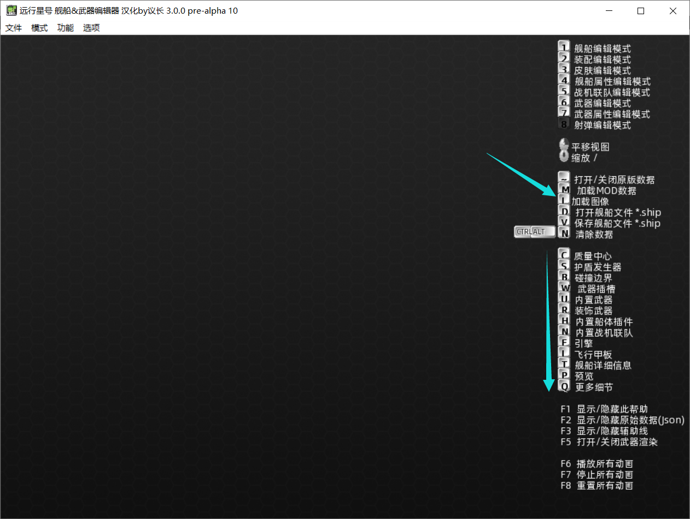

### 设置碰撞圈

首先按 C 设置质量中心和碰撞圈(俗称 `黄圈`)：

::: tip 质量中心

除非有极特殊的要求，否则**质量中心一般设为贴图中心**。

:::

::: danger 黄圈设置

黄圈**必须**包括贴图的所有部分在内。

黄圈**必须**显著地略大于贴图，但别太大。

:::

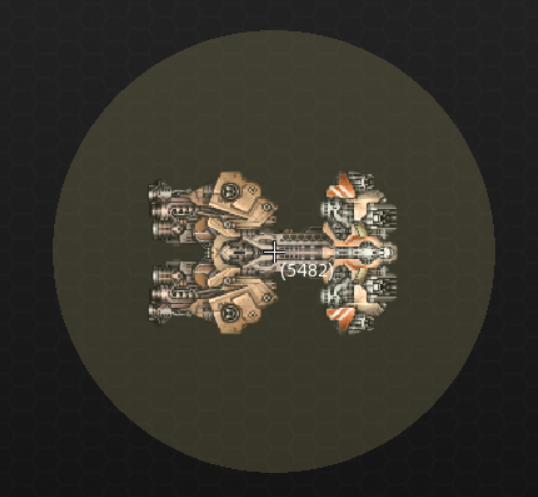

### 设置护盾范围

然后按 S 设置护盾中心和护盾范围(俗称 `蓝圈`)：

::: tip 护盾中心

除非有极特殊的要求，否则**护盾中心一般和质量中心重合**。

:::

::: danger 蓝圈设置

蓝圈**必须**全部在黄圈的范围内。

蓝圈**非常建议**覆盖整个贴图，否则将产生某些预期之外的后果。

:::

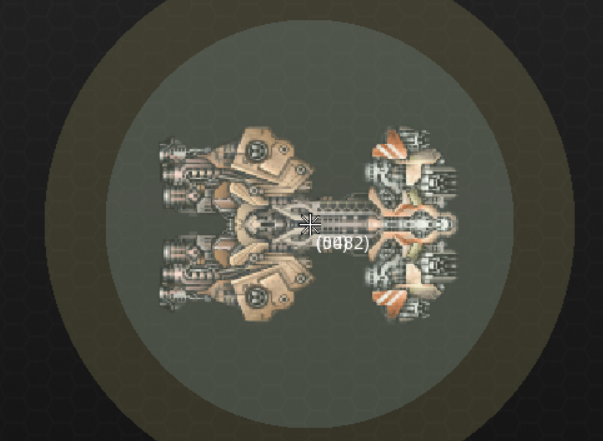

### 设置碰撞箱

然后按 B 设置碰撞箱。设置碰撞箱时，可以按 空格 键切换是否对称设置：

::: danger 碰撞箱设置

碰撞箱的每一个端点都**必须**在有完全不透明像素的位置，否则可能在装甲完好的情况下异常损失结构。

碰撞箱**不应该**过度密集，否则会显著影响您的游戏性能。

碰撞箱**不应该**过度稀疏。

:::

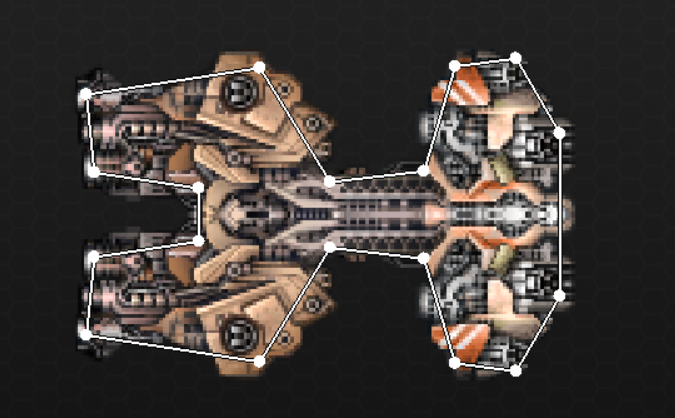

### 设置槽位

然后按 W 设置槽位。使用 Shift + 鼠标等拖拽、切换槽位的位置和朝向。可以按 空格 键切换是否对称设置。详细可用操作见编辑器的右下角。

在设置完毕所有槽位后，可以按 T 对每一个槽位的具体属性进行设置。

::: danger 槽位设置

每一个非隐藏槽位的坐标都**必须**为整数，否则武器会糊。

:::

| 槽位形态(mount) | 实际意义                                                     |
| --------------- | ------------------------------------------------------------ |
| TURRET          | 炮塔                                                         |
| HARDPOINT       | 固定槽位，转速相比炮塔减半，但武器血量增加。**固定槽位的角度通常是 10 度**。 |
| HIDDEN          | 隐藏槽位，安装在隐藏槽位的武器永远不会下线。                 |

| 槽位大小(size) | 实际意义 |
| -------------- | -------- |
| SMALL          | 小型     |
| MEDIUM         | 中型     |
| LARGE          | 大型     |

| 槽位类型(type) | 实际意义                                                     |
| -------------- | ------------------------------------------------------------ |
| BALLISTIC      | 实弹槽位                                                     |
| ENERGY         | 能量槽位                                                     |
| MISSILE        | 导弹槽位                                                     |
| HYBRID         | 混合槽位，实弹+能量                                          |
| SYNERGY        | 协同槽位，能量+导弹                                          |
| COMPOSITE      | 复合槽位，实弹+导弹                                          |
| UNIVERSAL      | 通用槽位，全类型                                             |
| BUILT_IN       | 内置槽位，不可手动安装武器，舰船内置武器                     |
| SYSTEM         | 系统槽位，进阶类型，**当前阶段不必掌握**                     |
| DECORATE       | 装饰槽位，进阶类型，**当前阶段不必掌握**                     |
| STATION_MODULE | 模块连接点，进阶类型，**当前阶段不必掌握**                   |
| LAUNCH_BAY     | 可能导致 BUG，**务必不要把武器设置为这个类型**。若需要添加甲板，详见后文 |

| 其它有意义数据 | 实际意义                                                     |
| -------------- | ------------------------------------------------------------ |
| angle          | 槽位基础朝向                                                 |
| arc            | 槽位射角大小                                                 |
| renderOrderMod | 槽位渲染高度补正。在默认情况下，大型武器高于中型武器高于小型武器，炮塔武器高于固定点武器。可以通过调整此数据来调整武器渲染高度，数字越大越倾向于渲染在上层 |

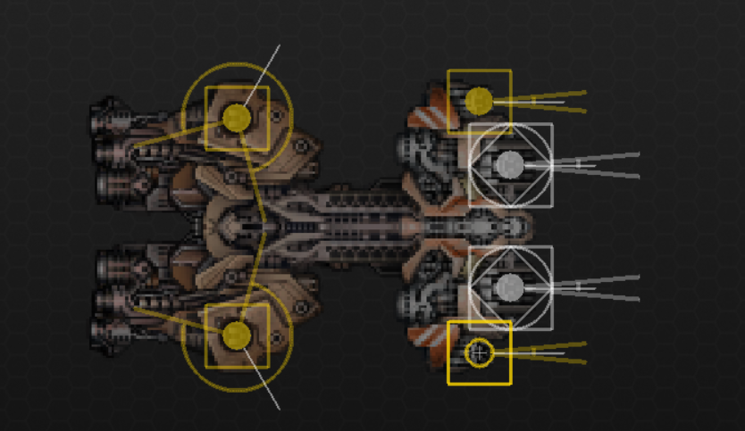

### 设置引擎

然后**跳过中间的部分**，按 E 设置引擎。使用 Shift + 鼠标等拖拽、切换引擎的位置和朝向。可以按 空格 键切换是否对称设置。详细可用操作见编辑器的右下角。

在设置完毕所有引擎后，可以按 T 对每一个引擎的具体属性进行设置。

| 原版预设引擎风格(style) | 与其它引擎风格的主要区别 |
| ----------------------- | ------------------------ |
| LOW_TECH                | 黄色，偏向于橘色         |
| MIDLINE                 | 黄色，偏向于亮黄色       |
| HIGH_TECH               | 蓝色                     |
| OMEGA                   | 紫色，带有光带拖尾       |
| COBRA_BOMBER            | 红色，带有大光晕         |

::: tip 引擎设置

引擎**应当**被设置在像素最边缘。

引擎可以适当拉长一些，过短往往会导致视觉效果不佳。

:::

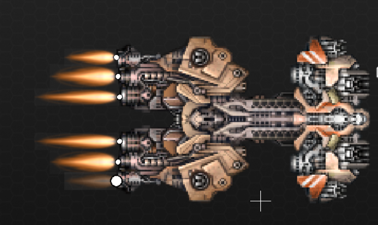

### 设置甲板？

`工匠-级`驱逐舰并不是一艘航母，所以它没有甲板。等到下文制作航母时再详细讨论如何正确设置甲板。

### 设置最终属性

按下 P，然后按下 T，设置最终属性。

| 舰船分级(hullSize) | 实际意义 |
| ------------------ | -------- |
| FRIGATE            | 护卫舰   |
| DESTROYER          | 驱逐舰   |
| CRUISER            | 巡洋舰   |
| CAPITAL_SHIP       | 主力舰   |
| FIGHTER            | 战机     |

| 原版预设舰船风格(style) | 与其它舰船风格的主要区别 |
| ----------------------- | ------------------------ |
| LOW_TECH                | 红色护盾                 |
| MIDLINE                 | 蓝色护盾                 |
| HIGH_TECH               | 蓝色护盾                 |

对于`hullId`和`hullName`两项，请全部填写 舰船 ID。

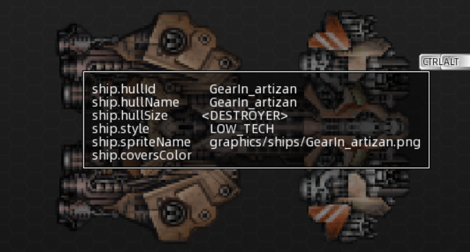

按 V 保存。

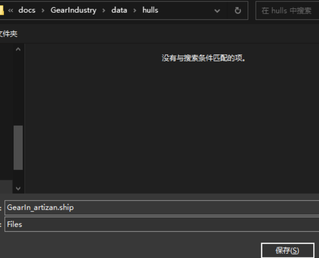

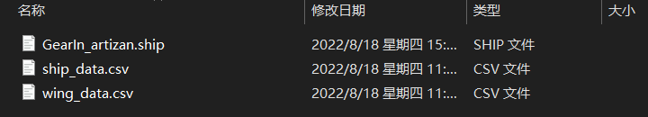

您已经完成了制作一艘船最难的部分了。

## 制作舰船数据

舰船数据的格式是`CSV`。打开`ship_data.csv`，这个文件里即为舰船数据，且编者在里面留下了一些数据标本以供您参考。

::: details CSV 基础实用介绍

`CSV`的第一行是标签，从第二行开始则会被当做数据读取。

但是，如果某一行的最前方有一个`#`符号，则这一行会被忽略。

在默认情况下，CSV 以`英文逗号`对数据进行分割。因此如果数据本身包括`英文逗号`，则需要`英文引号`包络。

:::

**最为简单的做法自然是复制粘贴**。您可以在原版寻找各类舰船的数据，将其复制粘贴到本文件。而在本例，选择`锤头-级`驱逐舰的数据，将其复制，然后修改：

::: danger 注意

复制时不要忘记删除最前方的`#`符号。

:::

```csv {12}
name,id,designation,tech/manufacturer,system id,fleet pts,hitpoints,armor rating,max flux,8/6/5/4%,flux dissipation,ordnance points,fighter bays,max speed,acceleration,deceleration,max turn rate,turn acceleration,mass,shield type,defense id,shield arc,shield upkeep,shield efficiency,phase cost,phase upkeep,min crew,max crew,cargo,fuel,fuel/ly,range,max burn,base value,cr %/day,CR to deploy,peak CR sec,CR loss/sec,supplies/rec,supplies/mo,c/s,c/f,f/s,f/f,crew/s,crew/f,hints,tags,rarity,breakProb,minPieces,maxPieces,travel drive,number
,,,,,,,,,,,,,,,,,,,,,,,,,,,,,,,,,,,,,,,,,,,,,,,,,,,,,
#Lasher,lasher,Frigate,Low Tech,ammofeed,5,1750,300,2100,1750,140,55,,120,110,90,60,90,200,FRONT,,210,0.4,1,,,25,50,40,25,1,25,10,9000,8,10,240,0.25,4,4,,,,,,,,"lowtech_bp, merc",,0.4,2,2,,204
,,,,,,,,,,,,,,,,,,,,,,,,,,,,,,,,,,,,,,,,,,,,,,,,,,,,,
#Hammerhead,hammerhead,Destroyer,Midline,ammofeed,10,5000,500,4200,4167,250,95,,90,60,40,30,60,400,FRONT,,300,0.4,0.8,,,50,100,100,60,2,30,9,40000,5,12,360,0.25,10,10,,,,,,,,"midline_bp, merc",,0.5,2,3,,300
,,,,,,,,,,,,,,,,,,,,,,,,,,,,,,,,,,,,,,,,,,,,,,,,,,,,,
#Eagle,eagle,Cruiser,Midline,maneuveringjets,14,8000,1000,11000,12000,600,155,,50,30,20,15,20,1200,FRONT,,270,0.4,0.8,,,150,250,150,100,3,33,8,120000,3,12,480,0.25,22,22,,,,,,,,"rare_bp, merc",,0.5,2,3,,401
,,,,,,,,,,,,,,,,,,,,,,,,,,,,,,,,,,,,,,,,,,,,,,,,,,,,,
#Conquest,conquest,Battlecruiser,Midline,maneuveringjets,24,12000,1200,20000,30000,1200,315,,45,20,15,6,4,2500,OMNI,,90,0.4,1.4,,,400,500,300,300,10,30,8,300000,3,15,600,0.25,40,40,,,,,,,,"rare_bp, merc",,0.5,2,4,,503
,,,,,,,,,,,,,,,,,,,,,,,,,,,,

工匠,GearIn_artizan,驱逐舰,未知,ammofeed,10,5000,500,3800,4167,200,95,,80,60,40,30,60,400,FRONT,,300,0.4,0.8,,,50,100,100,60,2,30,9,40000,5,12,360,0.25,10,10,,,,,,,,"GearIn_bp",,0.5,2,3,,300
```

**一艘船最重要的特征是要有趣**。

在本例中，`工匠-级`驱逐舰将`锤头-级`的中实弹替换为中通用，可以安装强力的导弹武器。编者对于歼灭者的表现十分感兴趣，因此将它的幅能容量、幅能耗散与速度都设为略低于和`锤头-级`，来让这艘船更大地依赖它的导弹优势。

::: tip 提前准备

将新船的`tag`中的内容修改为`前缀名_bp`，在本例中为`GearIn_bp`。日后将会有用。

除非它是您不希望大量出现的舰船——在这种情况下，您可以将`tag`中的内容清空。

::: 

### 实用数据速查表

**不在本表上的数据均为无意义数据(如 8/6/5/4%)或不重要数据(如 number)。**

| 英文              | 实际意义                                                     |
| ----------------- | ------------------------------------------------------------ |
| name              | 舰船的名称，可以为空。为空时将以`designation`作为舰船的名称  |
| id                | 在此填写舰船 ID                                              |
| designation       | 设计类型，会显示在舰船名称后面的那一段字，可随意填写         |
| tech/manu         | 科技类型，原版包括诸如 核心纪元、主宰纪元 等，可随意填写     |
| system id         | 战术系统 ID，原版的战术系统在`data\shipsystems\ship_systems.csv` |
| fleet pts         | 在大地图自动作战时的战斗力系数。但因为生成舰队本就是按固定总量战斗力生成，因此写得太高也没有用 |
| hitpoints         | 结构                                                         |
| armor             | 装甲                                                         |
| max flux          | 幅能容量                                                     |
| flux dissipation  | 幅能耗散                                                     |
| ordnance points   | 装配点数                                                     |
| fighter bays      | 甲板数量                                                     |
| max speed         | 战斗中最大速度，往往不认为最大速度是`机动性`的一部分         |
| acceleration      | 加速度，是`机动性`的一部分                                   |
| deceleration      | 减速度，是`机动性`的一部分                                   |
| max turn rate     | 转向速度上限，是`机动性`的一部分                             |
| turn acceleration | 转向加速度，是`机动性`的一部分                               |
| mass              | 舰船质量，舰船撞击伤害和双方的质量之和成正比，而不是质量乘积 |
| shield type       | 右键防御类型，有 `NONE(无盾)` `FRONT(前盾)` `OMNI(全盾)` `PHASE(右键战术系统。相位也是战术系统的一种)` |
| defense id        | 仅当`shield type`填写了`PHASE`才起效，右键战术系统的 ID      |
| shield arc        | 仅当`shield type`填写了`FRONT`或`OMNI`才起效，护盾角度       |
| shield upkeep     | 仅当`shield type`填写了`FRONT`或`OMNI`才起效，护盾维持幅能倍率，最终基础护盾维持幅能为`基础耗散 * 护盾维持幅能倍率`。当填写 0.1 时，开启护盾时每秒产生 10% 基础耗散的软幅能 |
| shield efficiency | 仅当`shield type`填写了`FRONT`或`OMNI`才起效，护盾效率。当填写 1.4 时，护盾每受到 1 等效伤害就提高 1.4 硬幅能 |
| phase cost        | 仅当`shield type`填写了`PHASE`才起效，右键战术系统的激活幅能倍率，最终右键战术系统激活幅能为`基础容量 * 激活幅能倍率` |
| phase upkeep      | 仅当`shield type`填写了`PHASE`才起效，右键战术系统的维持幅能倍率，最终右键战术系统维持幅能为`基础耗散 * 维持幅能倍率` |
| min crew          | 最小船员需求                                                 |
| max crew          | 最大载员量                                                   |
| cargo             | 最大货物容量                                                 |
| fuel              | 最大燃料容量                                                 |
| fuel/ly           | 在超空间中，每航行`1 ly(1 光年)`消耗的燃料数                 |
| max burn          | 大地图中最大速度                                             |
| base value        | 成本价                                                       |
| cr %/day          | 在补给充足的情况下，每日回复的`CR`数量                       |
| CR to deploy      | 每次部署消耗的`CR`数量                                       |
| peak CR sec       | 峰值时间                                                     |
| CR loss/sec       | 当峰值时间耗尽后，每秒下降的`CR`量                           |
| supplies/rec      | 部署点，且还是每次部署消耗的补给数量                         |
| supplies/mo       | 每月消耗的补给数                                             |
| hints             | 进阶内容，不可随意编纂，后文详细解释                         |
| tags              | 进阶内容，可随意编纂，后文详细解释                           |
| rarity            | 稀有度，数字越小越罕见，大于 1 时被视为 1，小于 0 时被视为 0 |
| breakProb         | 停机时被炸个粉碎的概率                                       |
| minPieces         | 如果停机时被炸碎了，那么至少变成多少块                       |
| maxPieces         | 如果停机时被炸碎了，那么至多变成多少块                       |
| travel drive      | 进场与出场时使用的战术系统                                   |

### 实用 Hints 速查表

**不在本表上的数据均为无意义 Hints(如 TRANSPORT)或不重要 Hints(如 WEAPONS_FRONT_TO_BACK)。**

| 英文                         | 实际意义                                                     |
| ---------------------------- | ------------------------------------------------------------ |
| PHASE                        | 这艘船在战斗中的 AI 行为被设为相位舰，且在某些生涯判定中被认为是相位舰。此外它的右键战术系统会被以相位的文字格式显示 |
| CIVILIAN                     | 这艘船在战斗中的 AI 行为被设为民用船，且在某些生涯判定中被认为是民用船 |
| FREIGHTER                    | 这艘船被认为有相对强大的货运能力                             |
| TANKER                       | 这艘船被认为有相对强大的油运能力                             |
| LINER                        | 这艘船被认为有相对强大的载员能力                             |
| CARRIER                      | 这艘船在战斗中的 AI 行为被设为航母                           |
| COMBAT                       | 配合`CIVILIAN`或`CARRIER`使用，让舰船的 AI 行为稍偏向于正常战舰 |
| NO_AUTO_ESCORT               | 配合`CARRIER`使用，除非刻意给出指挥命令，否则这艘船在战斗中不会主动用战机掩护队友 |
| UNBOARDABLE                  | 除非`tag`中包含`auto_rec`且玩家点了`无人战舰`，否则不可打捞  |
| STATION                      | 这艘船在战斗中的 AI 行为被设为空间站，且无法手动操控         |
| SHIP_WITH_MODULES            | 这艘船被设为模块船的本体，与`STATION`互斥。如果没有这个`hints`，则船上的模块将在某些情况下出现严重的表现异常 |
| HIDE_IN_CODEX                | 这艘船不会在数据库中出现                                     |
| UNDER_PARENT                 | 仅对模块船的模块生效，让这艘船从视觉上被安置在主体的底下     |
| INDEPENDENT_ROTATION         | 仅对模块船的模块生效，让这艘船的旋转不跟随它的主体           |
| ALWAYS_PANIC                 | 这艘船在战斗中的 AI 行为被设为更容易退缩，且更频繁地使用导弹武器 |
| RENDER_ENGINES_BELOW_HULL    | 这艘船的引擎被渲染在舰船贴图的底下而非上方                   |
| NO_NEURAL_LINK               | 这艘船无法安装`神经链接`                                     |
| PHASE                        | 这艘船在战斗中的 AI 行为被设为相位舰，且在某些生涯判定中被认为是相位舰 |
| PLAY_FIGHTER_OVERLOAD_SOUNDS | 仅对战机生效，过载时播放如同舰船一样的过载音效               |

## 首舰下水

**无论您的数据风格是贴合原版，亦或明显过强、过弱，甚至强度紊乱，本教程都将一视同仁**。

当您按照您的意愿填写完毕舰船数据之后，这艘船就能被游戏读取了。目前您还没有为它添加合理的获取方式，因此您只能使用`控制台`的`Addship [您的舰船 ID]`来获取它。

但在做下一步之前，强烈推荐您亲自试一下您制作的舰船。

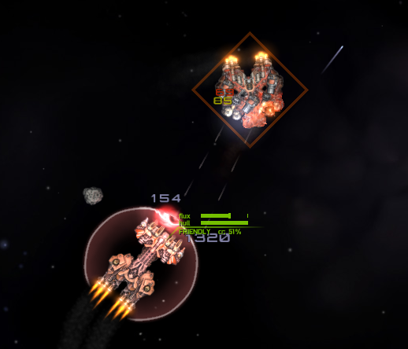

这艘`工匠-级`驱逐舰的表现相当不错，可以利用源源不断的火箭弹进行近距离压制，不过一旦被同等重火力盯上就会陷入僵局，而且难以利用它的战术系统。它也许还可以使用安超配置并搭载离子脉冲，总得来说作为一艘高手感驱逐舰来说还算成功，但依然需要一些微调。
