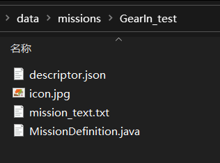
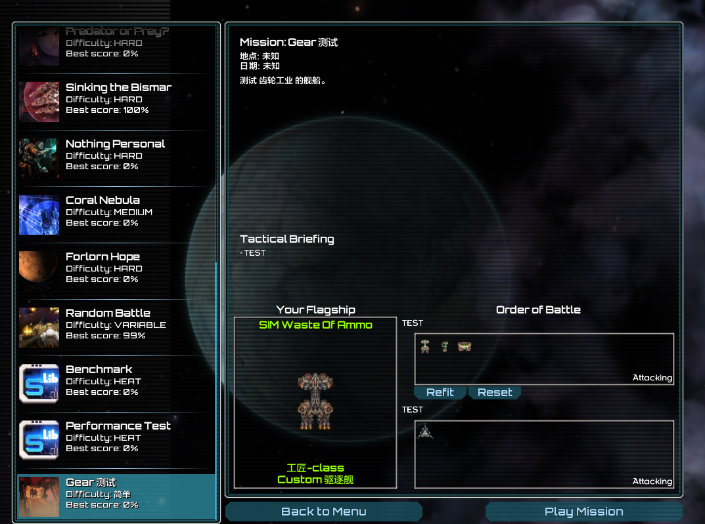
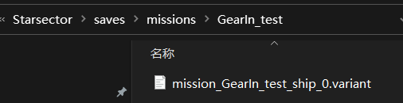

# 制作测试战役与战役

*本节预期阅读时间：~10 分钟。*

*本节预期操作时间：~10 分钟。*

## 制作测试战役

在制作真正的战役之前，需要有舰船的装配。但是若需要制作舰船的装配，则最好的方法却又往往是从战役里导出。这种先有鸡还是先有蛋的问题可以被**测试战役**解决。

在`data/missions`中新建一个文件夹，将其命名为`前缀名_test`，这是这个战役的文件夹，在本例中为`GearIn_test`。然后打开`mission_list.csv`，将`GearIn_test`填入第二行，为这个战役注册：

```csv {2}
mission
GearIn_test
```

注册战役后，开始设置这个测试战役的具体内容。首先随机挑选一个原版战役，将它文件夹里的所有东西都复制到`GearIn_test`文件夹内：



然后逐个文件进行修改。首先是`descriptor.json`：

```json
{
	"title":"一次好买卖",
	"difficulty":"简单",
	"icon":"icon.jpg",
	"background":"graphics/backgrounds/background4.jpg",
}
```

| 英文       | 实际意义                     |
| ---------- | ---------------------------- |
| title      | 战役名称                     |
| difficulty | 战役难度，可随意填写         |
| icon       | 战役图标贴图，在战役文件夹内 |
| background | 战役背景贴图路径             |

`icon.jpg`是图标贴图，本例不做修改。

然后是`mission_text.txt`，里面是战役的详细文本，可以随意填写。

最后是`MissionDefinition.java`。本指南将直接分享一份测试战役框架，可以随意使用：

```java {1,20}
package data.missions.将此替换为战役文件夹名;

// shared by Nihilism, modified from AnyIDElse under license

import com.fs.starfarer.api.Global;
import com.fs.starfarer.api.combat.ShipAPI;
import com.fs.starfarer.api.combat.ShipVariantAPI;
import com.fs.starfarer.api.fleet.FleetGoal;
import com.fs.starfarer.api.fleet.FleetMemberType;
import com.fs.starfarer.api.mission.FleetSide;
import com.fs.starfarer.api.mission.MissionDefinitionAPI;
import com.fs.starfarer.api.mission.MissionDefinitionPlugin;

import java.util.ArrayList;
import java.util.Collections;
import java.util.List;

public class MissionDefinition implements MissionDefinitionPlugin {

	public static final String prefix = "将此替换为前缀名";

	@Override
	public void defineMission(MissionDefinitionAPI api) {
		api.initFleet(FleetSide.PLAYER, "SIM", FleetGoal.ATTACK, false, 5);
		api.initFleet(FleetSide.ENEMY, "SIM", FleetGoal.ATTACK, true, 5);

		api.setFleetTagline(FleetSide.PLAYER, "TEST");
		api.setFleetTagline(FleetSide.ENEMY, "TEST");

		api.addBriefingItem("TEST");

		List<String> variants = new ArrayList();
		for (String id : Global.getSettings().getAllVariantIds()) {
			ShipVariantAPI variant = Global.getSettings().getVariant(id);
			if (variant.getHullSpec().getHullId().startsWith(prefix) && variant.getHullSpec().getHullSize() != ShipAPI.HullSize.FIGHTER && !id.startsWith("mission_")) {
				variants.add(id);
			}
		}
		Collections.sort(variants);

		boolean first = true;
		for (String variant : variants) {
			api.addToFleet(FleetSide.PLAYER, variant, FleetMemberType.SHIP, first);
			first = false;
		}

		api.addToFleet(FleetSide.ENEMY, "remnant_station2_Standard", FleetMemberType.SHIP, false);

		float width = 10000f;
		float height = 10000f;
		api.initMap(-width / 2f, width / 2f, -height / 2f, height / 2f);

		float minX = -width / 2;
		float minY = -height / 2;

		api.addNebula(minX + width * 0.66f, minY + height * 0.5f, 2000);
		api.addNebula(minX + width * 0.25f, minY + height * 0.6f, 1000);
		api.addNebula(minX + width * 0.25f, minY + height * 0.4f, 1000);

		for (int i = 0; i < 5; i++) {
			float x = (float) Math.random() * width - width / 2;
			float y = (float) Math.random() * height - height / 2;
			float radius = 100f + (float) Math.random() * 400f;
			api.addNebula(x, y, radius);
		}

		api.addObjective(minX + width * 0.25f + 2000f, minY + height * 0.5f, "sensor_array");
		api.addObjective(minX + width * 0.75f - 2000f, minY + height * 0.5f, "comm_relay");
		api.addObjective(minX + width * 0.33f + 2000f, minY + height * 0.4f, "nav_buoy");
		api.addObjective(minX + width * 0.66f - 2000f, minY + height * 0.6f, "nav_buoy");

		api.addAsteroidField(-(minY + height), minY + height, -45, 2000f, 20f, 70f, 100);
	}
}
```

**将代码中的两个替换位点替换完毕**后可直接使用，它会自动将您 MOD 中的所有舰船列出，无需后期修正。



## 制作装配

您可以在测试战役中为您的舰船安装武器、插件等。被装配过的舰船，会在如下目录自动生成装配文件：



将它剪贴(而非复制)到您 MOD 中`data/variants`文件夹内，然后修改文件名为更容易辨识的样子。在本例中，这是`GearIn_artizan`这艘舰船的装配，那么就将文件命名为`GearIn_artizan_combat.variant`，它的装配 ID 设为`GearIn_artizan_combat`。然后打开这个文件，准备进行进一步修改：

```json
{
    "displayName": "Custom",
    "fluxCapacitors": 0,
    "fluxVents": 0,
    "hullId": "GearIn_artizan",
    "hullMods": [],
    "permaMods": [],
    "sMods": [],
    "variantId": "mission_GearIn_test_ship_0",
    "weaponGroups": [
        {
            "autofire": false,
            "mode": "LINKED",
            "weapons": {
                "WS0003": "lightdualac",
                "WS0004": "lightdualac"
            }
        },
        {
            "autofire": true,
            "mode": "ALTERNATING",
            "weapons": {
                "WS0001": "phasecl",
                "WS0002": "phasecl"
            }
        },
        {
            "autofire": true,
            "mode": "LINKED",
            "weapons": {
                "WS0005": "GearIn_durin",
                "WS0006": "GearIn_durin"
            }
        }
    ]
}
```

如果您还记得，那么您在此前制作战机装配的时候已经见过一份类似的文件了。事实上，**舰船装配文件和战机装配文件没有本质区别**，因此在本例只需要调整装配 ID`variantId`将其设为`GearIn_artizan_combat`，并把装配名`displayName`从 Custom 设为其它希望设置的装配名即可。

::: tip 自动装配

如果您希望装配会出现在装配界面左下角的`自动装配`里，您需要在`variantId`附近为它加上：

```json
    "goalVariant": true,
```

:::

编者建议您接下来为您的所有舰船制作 2~3 个装配，以待稍后使用。

## 制作战役

在您已经拥有了装配的情况下，制作通常战役极其简单。

您只需要先想好您战役的名字，编纂一个合理又不会重复的战役 ID，然后像刚才一样随机挑选一个原版战役文件夹，将它复制到您的`data/missions`文件夹内，然后修改文件夹名、`MissionDefinition.java`内的路径名、`MissionDefinition.java`内对应的文本和装配 ID，最后再在`mission_list.csv`中注册即可。
