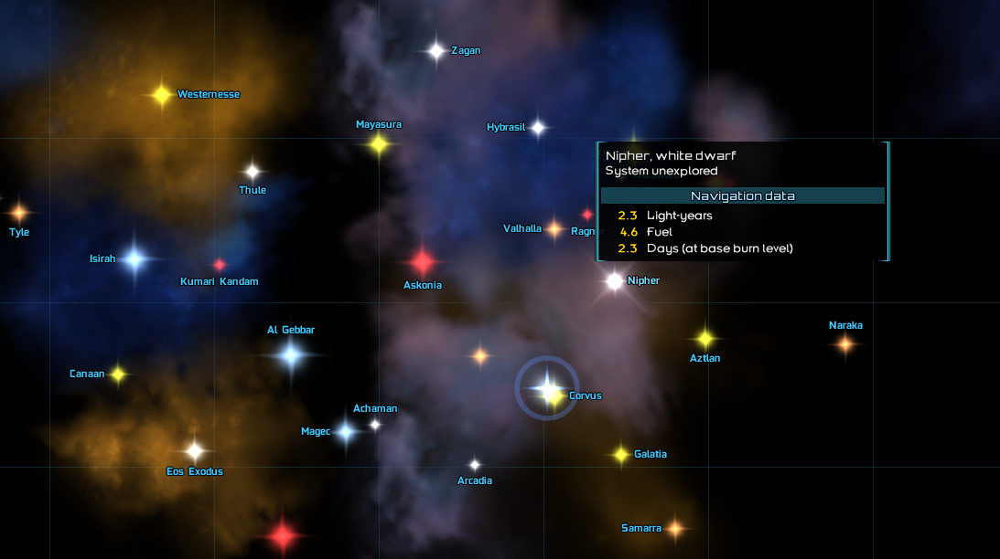
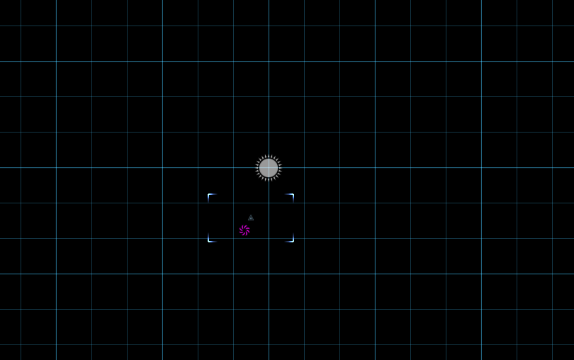

# 制作新星系

*本节预期阅读时间：~15 分钟。*

*本节预期操作时间：~20 分钟。*

## 制作 ModPlugin

很不幸的是，您接下来将不可避免地接触微量的简单代码。**如果您希望将您的 MOD 做好，那您以后将会接触更多、更难的代码，如果您连这部分都难以处理，那将很难进行日后的开发**。

但本教程提供了一份简单的 ModPlugin 与 Generator 框架，将它们保存为`.java`文件并放入`data/scripts`文件夹(可能需要自行新建文件夹)内：

```java
package data.scripts;

import com.fs.starfarer.api.BaseModPlugin;
import com.fs.starfarer.api.Global;
import com.fs.starfarer.api.impl.campaign.shared.SharedData;

// 修改文件名和下方为 前缀名_ModPlugin
// 在教程范例中为 GearIn_ModPlugin
public class YourNameModPlugin extends BaseModPlugin {
	
	@Override
	public void onGameLoad(boolean newGame) {

	}

	@Override
	public void beforeGameSave() {

	}

	@Override
	public void onApplicationLoad() {

	}
	
	@Override
	public void onNewGame() {

		if (NEX()) {
			
		} else {
			// 修改下方YourNameGenerate为 前缀名_NormalGenerate
			// 在教程范例中为 GearIn_NormalGenerate
			new YourNameGenerate().generate(Global.getSector());
		}

		SharedData.getData().getPersonBountyEventData().addParticipatingFaction("在此填写你的势力id");
	}

	public static boolean NEX() {
		return Global.getSettings().getModManager().isModEnabled("nexerelin");
	}
}
```

```java
package data.scripts;

import com.fs.starfarer.api.campaign.FactionAPI;
import com.fs.starfarer.api.campaign.RepLevel;
import com.fs.starfarer.api.campaign.SectorAPI;
import com.fs.starfarer.api.campaign.SectorGeneratorPlugin;

// 修改文件名和下方为 前缀名_NormalGenerate
// 在教程范例中为 GearIn_NormalGenerate
public class YourNameNormalGenerate implements SectorGeneratorPlugin {

	@Override
	public void generate(SectorAPI sector) {
		// 在此准备生成星系
		
		
		relationAdj(sector);
	}

	protected void relationAdj(SectorAPI sector) {
		FactionAPI faction = sector.getFaction("在此填写你的势力id");

        // 在原版 data.world.factions 查找势力id
        // RepLevel 是关系等级，详见原版 data.scripts.world.SectorGen
        
		faction.setRelationship("player", 0f);
		faction.setRelationship("pirates", RepLevel.HOSTILE);
		faction.setRelationship("hegemony", RepLevel.FRIENDLY);
		faction.setRelationship("tritachyon", RepLevel.HOSTILE);
		
		faction.setRelationship("luddic_path", RepLevel.HOSTILE);
		faction.setRelationship("derelict", RepLevel.HOSTILE);
		faction.setRelationship("remnant", RepLevel.HOSTILE);

		faction.setRelationship("cabal", RepLevel.VENGEFUL);
	}
}
```

## 制作星系

在安置框架并修改了框架内明确标注的几个对应点之后，即可开始编写星系了。进入到`data/scripts/world/systems`(可能也需要自行新建文件夹)，并再次安置如下框架：

```java
package data.scripts.world.systems;

import com.fs.starfarer.api.Global;
import com.fs.starfarer.api.campaign.*;
import com.fs.starfarer.api.campaign.econ.*;
import com.fs.starfarer.api.impl.*;
import com.fs.starfarer.api.impl.campaign.ids.*;
import com.fs.starfarer.api.impl.campaign.procgen.*;
import com.fs.starfarer.api.impl.campaign.terrain.MagneticFieldTerrainPlugin.*;
import com.fs.starfarer.api.util.Misc;

import java.awt.Color;
import java.util.*;

// 修改文件名和下方为 你的星系名
// 在教程范例中为 Nipher
public class YourSystemName {

	public void generate(SectorAPI sector) {
        
        StarSystemAPI system = sector.createStarSystem("在此输入你的星系名");
		system.getLocation().set(在此输入星系大地图坐标的X轴, 在此输入星系大地图坐标的Y轴);
		system.setBackgroundTextureFilename("graphics/backgrounds/在此输入星系贴图背景.jpg");
		system.setLightColor(new Color(200, 200, 210));

        PlanetAPI star = system.initStar("在此输入你的星系名", "star_white", 600f, 550f, 3f, 0.75f, 1f);
		star.setCustomDescriptionId("描述id，前缀名_星系名");
        
        // 稍后将在此加入星球生成代码
        
        

        system.autogenerateHyperspaceJumpPoints(true, true);
	}
}
```

调整此前的 Generator 文件：

```java {8,15}
package data.scripts;

import com.fs.starfarer.api.campaign.FactionAPI;
import com.fs.starfarer.api.campaign.RepLevel;
import com.fs.starfarer.api.campaign.SectorAPI;
import com.fs.starfarer.api.campaign.SectorGeneratorPlugin;

import data.scripts.world.systems.Nipher; // 加入 import

public class GearIn_NormalGenerate implements SectorGeneratorPlugin {

	@Override
	public void generate(SectorAPI sector) {
		// 在此准备生成星系
		new Nipher().generate(sector);

		relationAdj(sector);
	}

	protected void relationAdj(SectorAPI sector) {
		FactionAPI faction = sector.getFaction("gear_industry");

		faction.setRelationship("player", 0f);
		faction.setRelationship("pirates", RepLevel.HOSTILE);
		faction.setRelationship("hegemony", RepLevel.FRIENDLY);
		faction.setRelationship("tritachyon", RepLevel.HOSTILE);

		faction.setRelationship("luddic_path", RepLevel.HOSTILE);
		faction.setRelationship("derelict", RepLevel.HOSTILE);
		faction.setRelationship("remnant", RepLevel.HOSTILE);

		faction.setRelationship("cabal", RepLevel.VENGEFUL);
	}
}
```

最后修改你的`mod_info.json`文件：

```json {26}
{
	"id":"GearIndustry",
	"name":"齿轮工业 [Gear Industry]",
	"version":{"major":0, "minor":0, "patch":1},
	"gameVersion":"0.95.1a-RC6",
	"author":"Nihilist",
	"description":"一个简单的势力 MOD。",
	"dependencies": [
		{
			"id": "lw_lazylib",
			"name": "LazyLib",
			#"version": "xxx"
		},
		{
			"id": "shaderLib",
			"name": "GraphicLib",
			#"version": "xxx"
		},
		{
			"id": "MagicLib",
			"name": "MagicLib",
			#"version": "xxx"
		}
	],
	#"jars":["jars/yourJar.jar"],
	"modPlugin":"data.scripts.GearIn_ModPlugin" # 导入 ModPlugin，别忘了删掉前面的 # 号
}
```

然后游戏内就会出现你的星系：





虽然它现在空空如也，但稍后即可为它添加星球与各种各样的东西。

在**原版的`data/scripts/world/corvus`文件夹内，是 Covus 星系的生成文件。而在`data/scripts/world/systems`文件夹内则是几乎所有其它星系的生成文件**。

编者认为**一切创作的本质，不过是对现有元素的再次排列组合**，而在代码上则只需要不断复制、粘贴与修改即可。而您可以在上述各类星系里找到各自星球、陨石带、碎片带、极光、空间站、跳跃点、星门等物体的添加方法，只需要将它们任意进行排列组合，复制到您的星系文件中`// 稍后将在此加入星球生成代码`的下方，然后再根据所需进行微调即可。

如果您需要各类对于参数的注解，那么**您可以参考`齿轮工业`成品 MOD 范例的`data/scripts/world/systems/Nipher.java`文件**，在这里全部列出会导致篇幅过长。


## 让势力进入星系

添加的星球是无特征也无势力市场的，因此需要为它们添加星球特征与市场。接下来将这一段公开的源码插入到你的星系生成文件末尾的最后一个大括号前，**如不确定具体位置则请参照成品 MOD 范例**：

```java
	private MarketAPI addMarket(SectorEntityToken entity, String faction, float tarrif, List<String> conditions, List<String> industries, List<String> submarkets) {
		int size = 0;
		for (String condition : conditions) {
			if (condition.startsWith("population_")) {
				String sub = condition.replace("population_", "");
				size = Integer.parseInt(sub);
			}
		}

		MarketAPI market = MagicCampaign.addSimpleMarket(entity, entity.getId(), entity.getName(),
				size, faction, false, false,
				conditions, industries, false, false, false, false, false, false);

		if (conditions.contains("free_market")) market.setFreePort(true);
		for (String submarket : submarkets) {
			market.addSubmarket(submarket);
		}

		market.getTariff().modifyFlat("generator", tarrif);
		Global.getSector().getEconomy().addMarket(market, true);
        
        entity.setMarket(market);
		entity.setFaction(faction);
		return market;
	}
```

这个过程使用了`MagicLib`的`MagicCampaign`。`MagicLib`是三前置的一个，可以确定几乎所有玩家都会使用它。使用广为流传的前置 Mod 而非什么不知从何而来的陌生前置 Mod 更利于您 Mod 的流通。

因此别忘了新的导入：

```java
import data.scripts.util.MagicCampaign;
```

最后，您就可以简单地为星球生成市场：

```java
		MarketAPI market_1 = addMarket(GearIn_planet1, "gear_industry", 0.35f, // 星球和势力和税率
				// 在 data/campaign/conditions里找各类星球特质。其中，population_x是必要的
				new ArrayList(Arrays.asList("population_4", "thin_atmosphere", "hot", "ore_rich", "rare_ore_abundant")),
				new ArrayList(Arrays.asList("population", "spaceport", "mining", "refining", "heavybatteries", "orbitalworks", "battlestation")),
				new ArrayList(Arrays.asList("open_market", "generic_military", "black_market", "storage")));

		MarketAPI market_2 = addMarket(GearIn_planet2, "gear_industry", 0.35f, // 星球和势力和税率
				// 在 data/campaign/conditions里找各类星球特质。其中，population_x是必要的
				new ArrayList(Arrays.asList("population_4", "no_atmosphere", "meteor_impacts", "ore_rich", "rare_ore_abundant")),
				new ArrayList(Arrays.asList("population", "spaceport", "heavyindustry", "militarybase", "grounddefenses", "battlestation")),
				new ArrayList(Arrays.asList("open_market", "generic_military", "black_market", "storage")));
```

即可重新开档体验完整、带势力的星系。


