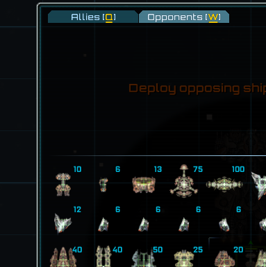

# 模拟战与标题演示

*本节预期阅读时间：~3 分钟。*

*本节预期操作时间：~5 分钟。*

## 设置模拟战对手

在框架的帮助下，设置会在模拟战出现的对手极为简单。打开`data/campaign`文件夹中的`sim_opponents.csv`，每行添加装配 ID 即可。本例中为：

```csv
variant id
GearIn_artizan_assault
GearIn_forging_assault
GearIn_furnaceman_combat
```

::: tip ID 缺失

若填错 ID 导致游戏无法读取某舰船，则会导致它变成一艘`星云-级`。

这一条在以后几乎一切需要加载装配的情况下都适用。

:::

保存即可在游戏中生效。



## 设置标题演示装配

设置会在标题界面飞过的舰船通用简单。打开`data/config`文件夹中，新建`title_screen_variants.csv`，在设置了`variant id`表头之后每行添加装配 ID 即可。本例中为：

```csv
variant id
GearIn_artizan_assault
```

::: tip 减少演示装配数

仅将您 MOD 内最具代表性的常规舰船放入标题演示中。

:::

由于标题演示装配的刷新是随机的，编者糟糕的运气导致它不常出现，仅有的一次出现还没有截图，因此本教程不提供截图展示。
