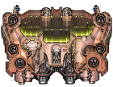
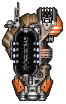
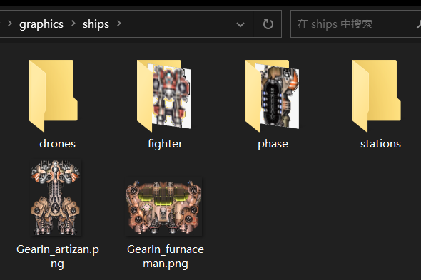
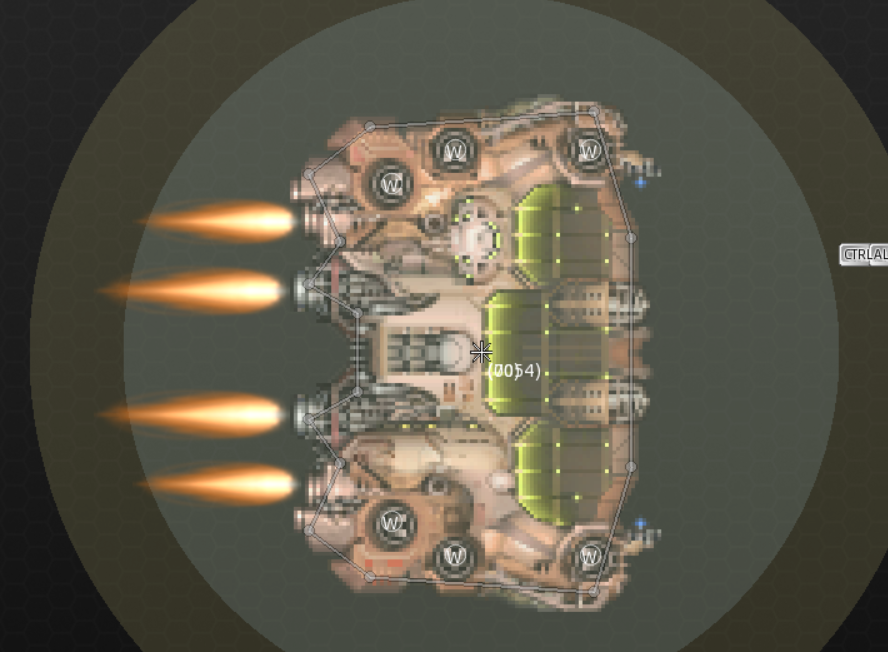
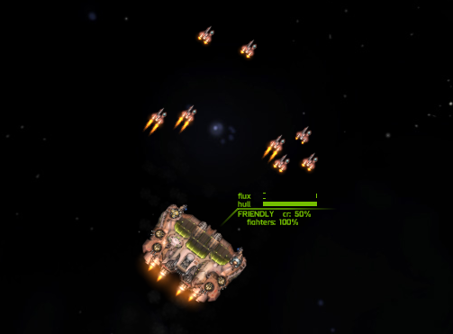
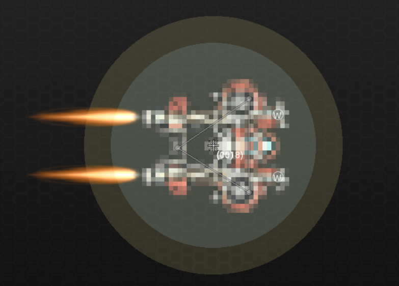
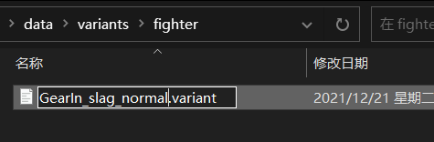
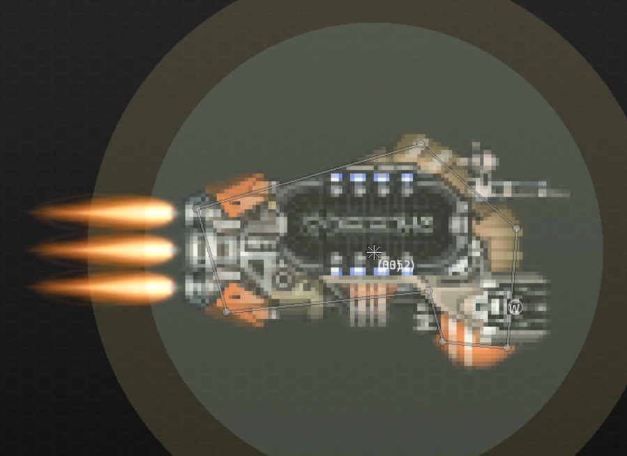
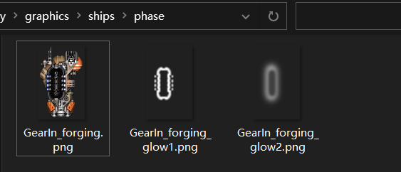
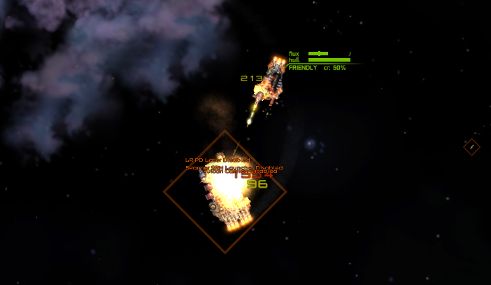

# 制作航母、战机与相位舰

*本节预期阅读时间：~20 分钟。*

*本节预期操作时间：~20 分钟。*

## 获取贴图

相信获取贴图的部分已经无需赘述了，这些被提供的贴图制作时长共计不到 1 分钟：






## 命名并将贴图放入正确的位置

::: tip 位置建议

所有战机都应该被放入`fighter`文件夹。

所有相位相关舰船都应该被放入`phase`文件夹。

:::



`守炉人-级(Furnaceman)`航母，ID 为`GearIn_furnaceman`。

`炉渣-级(Slag)`战机，ID 为`GearIn_slag`。

`锻件-级(Forging)`相位护卫舰，ID 为`GearIn_forging`。

## 制作航母舰船文件

### 预先制作

按照**与寻常舰船无异**的过程，制作`守炉人-级`航母的舰船文件。



### 设置甲板

按 L 设置甲板：

::: danger 甲板设置

每个甲板**必须拥有至少 2 个港口(Port)**，否则战机将从舰船中央出现。

建议每个甲板至少拥有 4 个港口。

:::


**每一个图标右下角的数字说明它属于第 x 个甲板**，由于`看炉人-级`航母只有 2 个甲板，所以右下角最大数字为 2。**而图标的数量则说明这个甲板有多少个港口**。

其它属性设置完毕后，按 V 保存。

相较于其它舰船，只需要注意甲板数量和港口数量即可，并没有什么特别的难点。

## 制作航母舰船数据

如前文所述，最为简单的做法是复制黏贴。打开原版的`ship_data.csv`，将`赶牛人-级`航母的数据复制过来，然后稍作修改：

```csv {13}
name,id,designation,tech/manufacturer,system id,fleet pts,hitpoints,armor rating,max flux,8/6/5/4%,flux dissipation,ordnance points,fighter bays,max speed,acceleration,deceleration,max turn rate,turn acceleration,mass,shield type,defense id,shield arc,shield upkeep,shield efficiency,phase cost,phase upkeep,min crew,max crew,cargo,fuel,fuel/ly,range,max burn,base value,cr %/day,CR to deploy,peak CR sec,CR loss/sec,supplies/rec,supplies/mo,c/s,c/f,f/s,f/f,crew/s,crew/f,hints,tags,rarity,breakProb,minPieces,maxPieces,travel drive,number
,,,,,,,,,,,,,,,,,,,,,,,,,,,,,,,,,,,,,,,,,,,,,,,,,,,,,
#Lasher,lasher,Frigate,Low Tech,ammofeed,5,1750,300,2100,1750,140,55,,120,110,90,60,90,200,FRONT,,210,0.4,1,,,25,50,40,25,1,25,10,9000,8,10,240,0.25,4,4,,,,,,,,"lowtech_bp, merc",,0.4,2,2,,204
,,,,,,,,,,,,,,,,,,,,,,,,,,,,,,,,,,,,,,,,,,,,,,,,,,,,,
#Hammerhead,hammerhead,Destroyer,Midline,ammofeed,10,5000,500,4200,4167,250,95,,90,60,40,30,60,400,FRONT,,300,0.4,0.8,,,50,100,100,60,2,30,9,40000,5,12,360,0.25,10,10,,,,,,,,"midline_bp, merc",,0.5,2,3,,300
,,,,,,,,,,,,,,,,,,,,,,,,,,,,,,,,,,,,,,,,,,,,,,,,,,,,,
#Eagle,eagle,Cruiser,Midline,maneuveringjets,14,8000,1000,11000,12000,600,155,,50,30,20,15,20,1200,FRONT,,270,0.4,0.8,,,150,250,150,100,3,33,8,120000,3,12,480,0.25,22,22,,,,,,,,"rare_bp, merc",,0.5,2,3,,401
,,,,,,,,,,,,,,,,,,,,,,,,,,,,,,,,,,,,,,,,,,,,,,,,,,,,,
#Conquest,conquest,Battlecruiser,Midline,maneuveringjets,24,12000,1200,20000,30000,1200,315,,45,20,15,6,4,2500,OMNI,,90,0.4,1.4,,,400,500,300,300,10,30,8,300000,3,15,600,0.25,40,40,,,,,,,,"rare_bp, merc",,0.5,2,4,,503
,,,,,,,,,,,,,,,,,,,,,,,,,,,,

工匠,GearIn_artizan,驱逐舰,未知,ammofeed,10,5000,500,3800,4167,200,95,,80,60,40,30,60,400,FRONT,,300,0.4,0.8,,,50,100,100,60,2,30,9,40000,5,12,360,0.25,10,10,,,,,,,,"GearIn_bp",,0.5,2,3,,300
看炉人,GearIn_furnaceman,轻型航母,未知,targetingfeed,11,4500,400,3000,2813,225,75,2,75,50,30,25,25,450,FRONT,,300,0.4,0.8,,,90,150,40,40,2,20,9,52000,5,15,360,0.25,13,13,,,,,,,CARRIER,"GearIn_bp",,0.5,2,3,,318

```

在本例中，`看炉人-级`航母的战术系统被替换为`苍鹭-级`的同款，来提供一种类似的“命令式”操作感。因为它的槽位大多数都被替换为防御型小型实弹槽位，因此为它提供更高的结构与更低的部署点作为幅度恰当的补偿。

航母需要填写`甲板数量`，此处为 2。

::: tip 提前准备

将新船的`tag`中的内容修改为`前缀名_bp`，在本例中为`GearIn_bp`。日后将会有用。

除非它是您不希望大量出现的舰船——在这种情况下，您可以将`tag`中的内容清空。

::: 

## 航母下水

使用`控制台`的`Addship [您的舰船 ID]`来获取它。



## 制作战机舰船文件

按照与寻常舰船无异的过程，制作`炉渣-级`战机的舰船文件。虽然“战机舰船文件”听上去很奇怪。

::: tip 战机制作注意点

战机的碰撞箱**应该尽可能简单**，甚至可以为此牺牲一些精度。

战机的武器**不应该选用`内置`**，因为后文需要对其进行装配。

不要选错`hullSize`。

:::



## 制作战机舰船的数据

“战机舰船的数据”听上去更奇怪了。

继续复制黏贴。打开原版的`ship_data.csv`，将`阔剑-级`战机的数据复制过来，然后稍作修改：

```csv {12}
name,id,designation,tech/manufacturer,system id,fleet pts,hitpoints,armor rating,max flux,8/6/5/4%,flux dissipation,ordnance points,fighter bays,max speed,acceleration,deceleration,max turn rate,turn acceleration,mass,shield type,defense id,shield arc,shield upkeep,shield efficiency,phase cost,phase upkeep,min crew,max crew,cargo,fuel,fuel/ly,range,max burn,base value,cr %/day,CR to deploy,peak CR sec,CR loss/sec,supplies/rec,supplies/mo,c/s,c/f,f/s,f/f,crew/s,crew/f,hints,tags,rarity,breakProb,minPieces,maxPieces,travel drive,number
,,,,,,,,,,,,,,,,,,,,,,,,,,,,,,,,,,,,,,,,,,,,,,,,,,,,,
#Lasher,lasher,Frigate,Low Tech,ammofeed,5,1750,300,2100,1750,140,55,,120,110,90,60,90,200,FRONT,,210,0.4,1,,,25,50,40,25,1,25,10,9000,8,10,240,0.25,4,4,,,,,,,,"lowtech_bp, merc",,0.4,2,2,,204
,,,,,,,,,,,,,,,,,,,,,,,,,,,,,,,,,,,,,,,,,,,,,,,,,,,,,
#Hammerhead,hammerhead,Destroyer,Midline,ammofeed,10,5000,500,4200,4167,250,95,,90,60,40,30,60,400,FRONT,,300,0.4,0.8,,,50,100,100,60,2,30,9,40000,5,12,360,0.25,10,10,,,,,,,,"midline_bp, merc",,0.5,2,3,,300
,,,,,,,,,,,,,,,,,,,,,,,,,,,,,,,,,,,,,,,,,,,,,,,,,,,,,
#Eagle,eagle,Cruiser,Midline,maneuveringjets,14,8000,1000,11000,12000,600,155,,50,30,20,15,20,1200,FRONT,,270,0.4,0.8,,,150,250,150,100,3,33,8,120000,3,12,480,0.25,22,22,,,,,,,,"rare_bp, merc",,0.5,2,3,,401
,,,,,,,,,,,,,,,,,,,,,,,,,,,,,,,,,,,,,,,,,,,,,,,,,,,,,
#Conquest,conquest,Battlecruiser,Midline,maneuveringjets,24,12000,1200,20000,30000,1200,315,,45,20,15,6,4,2500,OMNI,,90,0.4,1.4,,,400,500,300,300,10,30,8,300000,3,15,600,0.25,40,40,,,,,,,,"rare_bp, merc",,0.5,2,4,,503
,,,,,,,,,,,,,,,,,,,,,,,,,,,,

炉渣,GearIn_slag,,未知,flarelauncher_fighter,,750,100,200,,100,0,,180,400,350,90,180,30,NONE,,0,0,0,,,1,1,,,,,,,,,,,,,,,,,,,,,,0,,,,104

工匠,GearIn_artizan,驱逐舰,未知,ammofeed,10,5000,500,3800,4167,200,95,,80,60,40,30,60,400,FRONT,,300,0.4,0.8,,,50,100,100,60,2,30,9,40000,5,12,360,0.25,10,10,,,,,,,,"GearIn_bp",,0.5,2,3,,300
看炉人,GearIn_furnaceman,轻型航母,未知,targetingfeed,11,4500,400,3000,2813,225,75,2,75,50,30,25,25,450,FRONT,,300,0.4,0.8,,,90,150,40,40,2,20,9,52000,5,15,360,0.25,13,13,,,,,,,CARRIER,"GearIn_bp, merc",,0.5,2,3,,318
```

在本例中，`炉渣-级`战机的幅能被设为很高，因为`阔剑-级`战机是原版唯一用幅能限制了火力输出的战机——否则它的轻机枪就实在是秒天秒地了。作为对应调整，它将搭载双管轻型自动炮，且最大速度降低了 20。

## 制作战机的装配

虽然舰船编辑器的确拥有制作装配的功能，但编者**极度不推荐使用它**，因为它不利于建立文件直觉，且对于后期的进一步自定义没有任何正面价值。

继续复制黏贴。打开原版的`variants/fighters/`文件夹，找到`阔剑-级`的装配，将其复制到您 MOD 的对应位置。然后将文件名改为`舰船 ID + 某个后缀`，一般来说推荐后缀为`normal`或`variant`：



然后打开文件，准备修改：

```json
{
	"quality":0.5,
	"displayName":"Heavy Fighter",
	"hullId":"broadsword",
	"variantId":"broadsword_Fighter",
	"fluxVents":0,
	"fluxCapacitors":0,
	"hullMods":[], # array of strings
	
	# mode is either LINKED or ALTERNATING
	# slot ids (WS ***) must match what's in the .ship file
	"weaponGroups":[
		{"mode":"LINKED",
		 "weapons":{
		 			"WS 001":"lightmg",
		 			"WS 002":"lightmg",
		 		   },
		},
		{"mode":"LINKED",
		 "weapons":{
		 			#"WS 003":"swarmer_fighter",
		 		   },
		},
	],
}
```

### 战机装配文件速查表

**不在本表上的数据均为对于战机而言不必修改的数据或无意义数据。**

| 英文         | 实际意义                                                     |
| ------------ | ------------------------------------------------------------ |
| displayName  | 战机本装配的装配名，会在战机的数据页面被展示                 |
| hullId       | 战机本装配的舰船 ID，在本例为`GearIn_slag`                   |
| variantId    | 战机本装配的装配 ID，建议与文件名相同，在本例为`GearIn_slag_normal` |
| hullMods     | 战机本装配所安装的插件                                       |
| weaponGroups | 战机本装配的武器列表，在`weapons`项目里的则是具体武器。注意，图中诸如`WS 001`的是槽位 ID，**必须是战机本身确实拥有的槽位**，否则游戏将报错。而槽位 ID 后的则是武器 ID，可以查询`weapon_data.csv`。 |

经过修改的装配文件如下：

```json {3,4,5,15,16}
{
	"quality":0.5,
	"displayName":"重型战机",
	"hullId":"GearIn_slag",
	"variantId":"GearIn_slag_normal",
	"fluxVents":0,
	"fluxCapacitors":0,
	"hullMods":[], # array of strings
	
	# mode is either LINKED or ALTERNATING
	# slot ids (WS ***) must match what's in the .ship file
	"weaponGroups":[
		{"mode":"LINKED",
		 "weapons":{
		 			"WS0001":"lightdualac",
		 			"WS0002":"lightdualac",
		 		   },
		},
		{"mode":"LINKED",
		 "weapons":{
		 			#"WS 003":"swarmer_fighter",
		 		   },
		},
	],
}
```

::: danger 再次强调

一定要注意那些武器槽(`WSxxx`)是否存在于战机的船体文件里。

:::

## 制作战机的战机数据

“战机的战机数据”听上去比前两个还更奇怪。

打开`wing_data.csv`，继续复制粘贴。编者认为，既然`炉渣-级`是从`阔剑-级`修改而来的，那么就直接修改到底，战机数据也从`阔剑-级`里复制并修改：

```csv {12}
id,variant,tags,tier,rarity,fleet pts,op cost,formation,range,attackRunRange,attackPositionOffset,num,role,role desc,refit,base value,,,,,,,,,,,,,number
,,,,,,,,,,,,,,,,,,,,,,,,,,,,
#broadsword_wing,broadsword_Fighter,"fighter4, fighter, low, lowtech_bp, merc",0,,6,8,V,4000,500,,3,FIGHTER,Heavy Fighter,10,6000,,,,,,,,,,,,,1
,,,,,,,,,,,,,,,,,,,,,,,,,,,,
#talon_wing,talon_Interceptor,"interceptor1, interceptor, low, base_bp, merc",0,,3,2,V,4000,200,600,4,INTERCEPTOR,Interceptor,5,2000,,,,,,,,,,,,,6
,,,,,,,,,,,,,,,,,,,,,,,,,,,,
#dagger_wing,dagger_Bomber,"bomber4, bomber, high, hightech_bp, merc",2,,5,18,V,4000,2000,600,3,BOMBER,Bomber,18,9000,,,,,,,,,,,,,11
,,,,,,,,,,,,,,,,,,,,,,,,,,,,
#xyphos_wing,xyphos_Fighter,"support3, fighter, high, rare_bp, hist1t, merc",3,0.5,7,18,V,0,500,,2,SUPPORT,Support,15,10000,,,,,,,,,,,,,2
,,,,,,,,,,,,,,,,,,,,,,,,,,,,

GearIn_slag_wing,GearIn_slag_normal,"fighter4, fighter, low, GearIn_bp",0,,6,8,V,4000,500,,3,FIGHTER,重型战机,12,6000,,,,,,,,,,,,,1
```

::: tip 提前准备

将新战机的`tag`中的`low_bp`修改为`前缀名_bp`，在本例中为`GearIn_bp`。日后将会有用。

除非它是您不希望大量出现的战机——在这种情况下，您可以将`tag`中的内容适当清理。

::: 

### 实用战机数据速查表

**不在本表上的数据均为无意义数据(如 fleet pts)或不重要数据(如 number)。**

| 英文                 | 实际意义                                                     |
| -------------------- | ------------------------------------------------------------ |
| id                   | 战机的战机 ID，如果没有特别要求，应当以`_wing`结尾           |
| variant              | 战机所对应的装配文件，在本例中是`GearIn_slag_normal`         |
| tags                 | 进阶内容，可随意编纂，后文详细解释                           |
| tier                 | 科技等级，正常范围是 0~3，大于 3 将导致不会市场上正常出现。科技等级越大则越稀有且购买所需关系越高。 |
| rarity               | 稀有度，数字越小越罕见，大于 1 时被视为 1，小于 0 时被视为 0 |
| op cost              | 装配点数需求                                                 |
| formation            | 战机队形，允许的有`BOX`、`V`、`CLAW`和`DIAMOND`，分别是簇团、正 V 编队、反 V 编队和棱形编队 |
| range                | 最大交战距离                                                 |
| attackRunRange       | 当战机与敌舰交战时，最大允许的可后撤距离                     |
| attackPositionOffset | 战机攻击距离补正                                             |
| num                  | 每联队的战机数                                               |
| role                 | 战机的 AI 种类，允许的有`FIGHTER`、`INTERCEPTOR`、`BOMBER`、`SUPPORT`、`ASSAULT`。`FIGHTER`和`ASSAULT`都以反舰为主但前者更倾向于近距离作战，`INTERCEPTOR`以拦截战机为主，`BOMBER`是轰炸机，`SUPPORT`是不会主动离开母舰的支援机 |
| role desc            | 战机类型文字描述                                             |
| refit                | 战机整备所需秒数                                             |
| base value           | 每联队的成本价                                               |

### 实用战机 tags 速查表

**不在本表上的数据均为与战机本身性能无关的 tags(如 rare_bp)，关于这些 tags 详见后文。**

| 英文                   | 实际意义                                                     |
| ---------------------- | ------------------------------------------------------------ |
| fighter*               | 当进行自动装配时，优先使用 * 所处的位置较高的战机。例如 fighter2 总是会替代 fighter1 |
| interceptor*           | 当进行自动装配时，优先使用 * 所处的位置较高的战机。例如 interceptor2 总是会替代 interceptor1 |
| bomber*                | 当进行自动装配时，优先使用 * 所处的位置较高的战机。例如 bomber2 总是会替代 bomber1 |
| support*               | 当进行自动装配时，优先使用 * 所处的位置较高的战机。例如 support2 总是会替代 support1 |
|                        | **以上 4 条只应当包含 1 条**                                 |
| fighter                | 在装配界面被分类为战斗机                                     |
| interceptor            | 在装配界面被分类为拦截机                                     |
| bomber                 | 在装配界面被分类为轰炸机                                     |
|                        | **以上 3 条只应当包含 1 条**，若均不包含，则自动分类         |
| auto_fighter           | 只有包含此 tag 的战机才能被无人战舰使用                      |
| drone                  | 如果某个装配携带了包含此 tag 的战机，那么它将倾向于装满此类战机 |
| rapid_reform           | 联队将倾向于保持严格的阵型而非四散而开                       |
| leader_no_swarm        | 联队中的首机一旦接敌就会拉开距离，而非无脑蜂蛹而上           |
| wingmen_no_swarm       | 联队中的首机以外的战机旦接敌就会拉开距离，而非无脑蜂蛹而上   |
| match_leader_facing    | 联队中的其它所有战机与首机保持朝向完全一致                   |
| attack_at_an_angle     | 战机 AI 将倾向于使用最大武器倾角侧舷对敌，而非正面对敌       |
| independent_of_carrier | 当航母被消灭或无所属航母时，依然正常运作而非四散溃逃。且当场上没有任何同侧舰船时，这些战机不会自动自爆而是需要被手动消灭 |
| rd_no_extra_craft      | `后备部署`专供，使本战机不响应它的效果                       |

## 战机启航

使用`控制台`的`Addwing [您的战机 ID]`来获取它。


## 制作相位舰船文件

**相位舰的舰船文件，与寻常舰船相比没有任何区别**。

::: danger 注意

即使是相位舰，也必须设置合理的护盾范围。

:::



## 制作相位舰船的数据

打开原版的`ship_data.csv`，将`小精灵-级`相位舰的数据复制过来，然后稍作修改：

```csv {14}
name,id,designation,tech/manufacturer,system id,fleet pts,hitpoints,armor rating,max flux,8/6/5/4%,flux dissipation,ordnance points,fighter bays,max speed,acceleration,deceleration,max turn rate,turn acceleration,mass,shield type,defense id,shield arc,shield upkeep,shield efficiency,phase cost,phase upkeep,min crew,max crew,cargo,fuel,fuel/ly,range,max burn,base value,cr %/day,CR to deploy,peak CR sec,CR loss/sec,supplies/rec,supplies/mo,c/s,c/f,f/s,f/f,crew/s,crew/f,hints,tags,rarity,breakProb,minPieces,maxPieces,travel drive,number
,,,,,,,,,,,,,,,,,,,,,,,,,,,,,,,,,,,,,,,,,,,,,,,,,,,,,
#Lasher,lasher,Frigate,Low Tech,ammofeed,5,1750,300,2100,1750,140,55,,120,110,90,60,90,200,FRONT,,210,0.4,1,,,25,50,40,25,1,25,10,9000,8,10,240,0.25,4,4,,,,,,,,"lowtech_bp, merc",,0.4,2,2,,204
,,,,,,,,,,,,,,,,,,,,,,,,,,,,,,,,,,,,,,,,,,,,,,,,,,,,,
#Hammerhead,hammerhead,Destroyer,Midline,ammofeed,10,5000,500,4200,4167,250,95,,90,60,40,30,60,400,FRONT,,300,0.4,0.8,,,50,100,100,60,2,30,9,40000,5,12,360,0.25,10,10,,,,,,,,"midline_bp, merc",,0.5,2,3,,300
,,,,,,,,,,,,,,,,,,,,,,,,,,,,,,,,,,,,,,,,,,,,,,,,,,,,,
#Eagle,eagle,Cruiser,Midline,maneuveringjets,14,8000,1000,11000,12000,600,155,,50,30,20,15,20,1200,FRONT,,270,0.4,0.8,,,150,250,150,100,3,33,8,120000,3,12,480,0.25,22,22,,,,,,,,"rare_bp, merc",,0.5,2,3,,401
,,,,,,,,,,,,,,,,,,,,,,,,,,,,,,,,,,,,,,,,,,,,,,,,,,,,,
#Conquest,conquest,Battlecruiser,Midline,maneuveringjets,24,12000,1200,20000,30000,1200,315,,45,20,15,6,4,2500,OMNI,,90,0.4,1.4,,,400,500,300,300,10,30,8,300000,3,15,600,0.25,40,40,,,,,,,,"rare_bp, merc",,0.5,2,4,,503
,,,,,,,,,,,,,,,,,,,,,,,,,,,,

炉渣,GearIn_slag,,未知,flarelauncher_fighter,,750,100,200,,100,0,,180,400,350,90,180,30,NONE,,0,0,0,,,1,1,,,,,,,,,,,,,,,,,,,,,,0,,,,104

锻件,GearIn_forging,相位护卫舰,未知,ammofeed,6,2000,350,1200,2000,100,35,,90,120,90,45,90,200,PHASE,phasecloak,90,,,0.075,0.075,4,10,10,20,1,20,9,26000,10,20,180,0.25,6,6,,,,,,,PHASE,GearIn_bp,,0.5,2,2,,228

工匠,GearIn_artizan,驱逐舰,未知,ammofeed,10,5000,500,3800,4167,200,95,,80,60,40,30,60,400,FRONT,,300,0.4,0.8,,,50,100,100,60,2,30,9,40000,5,12,360,0.25,10,10,,,,,,,,"GearIn_bp",,0.5,2,3,,300
看炉人,GearIn_furnaceman,轻型航母,未知,targetingfeed,11,4500,400,3000,2813,225,75,2,75,50,30,25,25,450,FRONT,,300,0.4,0.8,,,90,150,40,40,2,20,9,52000,5,15,360,0.25,13,13,,,,,,,CARRIER,"GearIn_bp",,0.5,2,3,,318

```

在本例中，`锻件-级`相位护卫舰全船上下只有一个中型实弹武器槽位，因此它将专注于疯狂的实弹火力。为了加强手感，它的战术系统被替换为`加速填弹器`来在需要的时候提供超级输出，同时也弥补失去小型导弹的爆发不足。不过为了让这个过程显得更加紧张刺激，它的幅能耗散被直接砍到 100 ，来让它必须斟酌何时使用突击链炮。最后再略微抬升一些相位产生幅能，一艘相当有驾驶手感的相位船就做好了。

::: tip 提前准备

将新船的`tag`中的内容修改为`前缀名_bp`，在本例中为`GearIn_bp`。日后将会有用。

除非它是您不希望大量出现的舰船——在这种情况下，您可以将`tag`中的内容清空。

::: 

相位舰船的`defense id`为`PHASE`，且需要填写几个相位船独有的数据。

## 设置相位光效贴图

**但上述准备还不够，此时进入游戏必然出现报错**。

**因为相位舰船还需要 2 个额外的光效贴图文件**，作为进入相位后的 亮紫色/粉色 尾迹。所幸粗糙贴图的处理一直都不是什么难事：


看不到它们吗？

换个背景颜色：



::: danger 光效贴图文件

光效贴图文件**必须**位于和相位舰船同一位置。

光效贴图文件的文件名**必须**是`相位舰船的贴图文件名+_glow1`和`相位舰船的贴图文件名+_glow2`

光效贴图文件**应当**是纯白色的，否则将出现影响观感的颜色异常。

:::

## 相位舰下水

使用`控制台`的`Addship [您的舰船 ID]`来获取它。



## 模块船？

制作模块船至少要涉及装配文件，因此模块船将在更后的章节中才被讲解。
