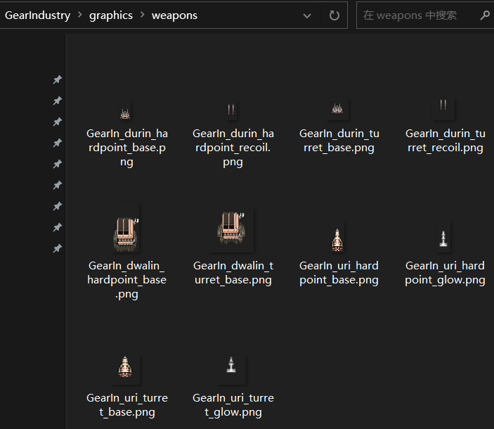

# 制作火炮、光束与导弹

*本节预期阅读时间：~15 分钟。*

*本节预期操作时间：~20 分钟。*

## 获取贴图

武器的贴图和舰船相比略有不同。

**远行星号 的武器表现形式根据槽位不同而分为`炮塔`和`固定槽位`，它们各自需要一套贴图**。一般来说，`固定槽位`的武器贴图比`炮塔`的更细更长。且`炮塔`武器的重心往往就在贴图中央，而`固定槽位`武器的重心则往往偏向于图片底部。

**而除了武器本身之外，还包括`光效`、`炮管`、`底座`这三个可选补充**。绝大多数武器至少有`光效`或`炮管`中的一种，而少数武器可能拥有两种，甚至全部三种。

本例将制作一个小型带炮管射弹武器，一个中型带光效光束武器，与一个大型不带炮管也不带光效的导弹武器。所以先准备它们的贴图：


耗时约 45 秒。

## 命名并将贴图放入正确的位置

**武器命名也有规范可言**。

武器的基础名称是`MOD 前缀名 + 武器 ID`，例如本例中一个武器叫`都林自动炮(Durin)`，则它的 ID 应当为`GearIn_durin`。以此类推，为所有武器命名并分配 ID。

而武器各个贴图则是在基础名称的基础上继续扩写。

首先扩写它是`炮塔`或`固定插槽`，如果是`炮塔`则在后面加上`_turret`，否则加上`_hardpoint`。然后扩写它的可选补充，如果是武器本身，则加上`_base`；如果是炮管，则加上`_recoil`；如果是光效，则加上`_glow`；如果是底座，则加上`_under`。

**听上去有些复杂，但是见过例子之后只需要不断地复制粘贴即可**。

最后，把这些武器放入`graphics/weapons`武器贴图文件夹内：



## 制作武器文件

制作武器文件也与制作舰船文件相比有所不同。**编者非常不推荐使用舰船编辑器的武器编辑模式，因为它相较而言难以上手、操作不便**。编者推荐寻找一门与目标武器类似的原版武器，然后复制粘贴修改。

### 制作火炮武器

编者设想的`都林自动炮`是一种发射高爆弹药的近距离速射武器，类似于`轻型突击炮`的低配版本，所以直接进入原版储存武器文件的`data/weapons`文件夹内，将它的`lightag.wpn`复制到 MOD 中`data/weapons`文件夹内，文件名改为`GearIn_durin.wpn`，然后准备修改：

```json
{
	"id":"lightag",  # this id must match what's in the spreadsheet
	"specClass":"projectile",
	"type":"BALLISTIC",
	"size":"SMALL",
	"displayArcRadius":400,
	"turretSprite":"graphics/weapons/light_assault_gun_turret_base.png",
	"turretGunSprite":"graphics/weapons/light_assault_gun_turret_recoil.png",
	"hardpointSprite":"graphics/weapons/light_assault_gun_hardpoint_base.png",
	"hardpointGunSprite":"graphics/weapons/light_assault_gun_hardpoint_recoil.png",	
	"visualRecoil":5.0,  # the gun sprites are only used if this is non-0
	"renderHints":[RENDER_BARREL_BELOW],
	"turretOffsets":[10, 0],
	"turretAngleOffsets":[0],
	"hardpointOffsets":[15, 0],
	"hardpointAngleOffsets":[0],
	"barrelMode":"ALTERNATING", # or LINKED.  whether barrels fire at the same time or alternate.
	"animationType":"MUZZLE_FLASH",  # NONE, GLOW, MUZZLE_FLASH, SMOKE
	"muzzleFlashSpec":{"length":30.0,   # only used if animationType = MUZZLE_FLASH
					   "spread":16.0,
					   "particleSizeMin":8.0,
					   "particleSizeRange":10.0,
					   "particleDuration":0.35,
					   "particleCount":12,
					  "particleColor":[255,155,105,185]},
	"projectileSpecId":"lightag_shot",  # projectile that will be fired
	"fireSoundTwo":"light_assault_gun_fire",	
}
```

看似一大片英文，但实际上要改的条目不多。

| 英文                                                         | 实际意义                                                     |
| ------------------------------------------------------------ | ------------------------------------------------------------ |
| id                                                           | 武器的 ID                                                    |
| type                                                         | 武器的类型，在本例中表示这是`实弹`类型武器，不变             |
| size                                                         | 武器的型号，在本例中表示这是`小型`武器，不变                 |
| turretSprite`、`turretGunSprite`、`hardpointSprite`、`hardpointGunSprite | 炮塔主体贴图、炮塔炮管贴图、固定槽位主体贴图、固定槽位炮管贴图，在本例中分别替换为前文贴图的路径 |
| visualRecoil                                                 | 炮管缩退距离，不变                                           |
| renderHints                                                  | 武器渲染模式，本例中表示这门武器将炮管渲染在主体的下方，不变。 |
| turretOffsets`、`turretAngleOffsets`、`hardpointOffsets`、`hardpointAngleOffsets | 炮塔开火点、炮塔开火角度、固定槽位开火点、固定槽位开火角度。因为本例的武器是双管自动炮，所以需要进行对应调整——每 2 个开火点数字表示 1 个坐标并对应 1 个开火角度数字。**开火点的坐标原点是贴图中心，第一个数字正/负是贴图的上/下，第二个数字正/负是贴图的左/右** |
| barrelMode                                                   | 炮管射击模式，在本例中为交替射击，不变                       |
| animationType、muzzleFlashSpec                               | 开火烟雾的视觉属性，不变。若您有兴趣可以自行百度翻译。       |
| projectileSpecId                                             | 武器所发射的弹体 ID，暂时不变，之后调整                      |
| fireSoundTwo                                                 | 武器开火音效，不变                                           |

**上表的内容并不完全**，在介绍完毕本章的三门武器之后，将重新总结一份速查表。

总而言之，只需要修改`id`、各个 sprite、各个 offsets 和 angleOffsets 即可，工作量极小：

```json {2,7,8,9,10,13,14,15,16}
{
	"id":"GearIn_durin",  # this id must match what's in the spreadsheet
	"specClass":"projectile",
	"type":"BALLISTIC",
	"size":"SMALL",
	"displayArcRadius":400,
	"turretSprite":"graphics/weapons/GearIn_durin_turret_base.png",
	"turretGunSprite":"graphics/weapons/GearIn_durin_turret_recoil.png",
	"hardpointSprite":"graphics/weapons/GearIn_durin_hardpoint_base.png",
	"hardpointGunSprite":"graphics/weapons/GearIn_durin_hardpoint_recoil.png",	
	"visualRecoil":5.0,  # the gun sprites are only used if this is non-0
	"renderHints":[RENDER_BARREL_BELOW],
	"turretOffsets":[15, 3, 15, -3],
	"turretAngleOffsets":[0, 0],
	"hardpointOffsets":[8, 3, 8, -3],
	"hardpointAngleOffsets":[0, 0],
	"barrelMode":"ALTERNATING", # or LINKED.  whether barrels fire at the same time or alternate.
	"animationType":"MUZZLE_FLASH",  # NONE, GLOW, MUZZLE_FLASH, SMOKE
	"muzzleFlashSpec":{"length":30.0,   # only used if animationType = MUZZLE_FLASH
					   "spread":16.0,
					   "particleSizeMin":8.0,
					   "particleSizeRange":10.0,
					   "particleDuration":0.35,
					   "particleCount":12,
					  "particleColor":[255,155,105,185]},
	"projectileSpecId":"lightag_shot",  # projectile that will be fired
	"fireSoundTwo":"light_assault_gun_fire",	
}
```

### 制作光束武器

编者设想的`乌里光束`是一种造成远距离能量伤害的光束武器，类似于`引力子束`的能量版本，所以直接将它的`gravitonbeam.wpn`复制到 MOD 中`data/weapons`文件夹内，文件名改为`GearIn_uri.wpn`，然后准备修改：

```json
{
	"specClass":"beam",
	"id":"gravitonbeam",
	"type":"ENERGY",
	"size":"MEDIUM",
	"displayArcRadius":550,
	"turretSprite":"graphics/weapons/graviton_beam_turret_base.png",
	"turretGlowSprite":"graphics/weapons/graviton_beam_turret_glow.png",
	"hardpointSprite":"graphics/weapons/graviton_beam_hardpoint_base.png",
	"hardpointGlowSprite":"graphics/weapons/graviton_beam_hardpoint_glow.png",
	"turretOffsets":[15, 0],
	"turretAngleOffsets":[0],
	"hardpointOffsets":[23, 0],
	"hardpointAngleOffsets":[0],
	"fringeColor":[5,135,175,255],
	"coreColor":[200,225,255,255],
	"glowColor":[25,215,255,255],
	"width":20.0,
	"textureType":ROUGH,
	"textureScrollSpeed":260.0,
	"pixelsPerTexel":5.0,
	"pierceSet":[PROJECTILE_FF,PROJECTILE_NO_FF,PROJECTILE_FIGHTER,MISSILE_FF,MISSILE_NO_FF],
	#"fireSoundOne":"graviton_beam_intro",
	"fireSoundTwo":"graviton_beam_loop",
}
```

实际上要改的依然不多。

`id`、各个 sprite、各个 offsets 和 angleOffsets 都已经是上面见过一次的熟面孔了。所以接下来列出的是此前没有出现过的条目。

| 英文                                            | 实际意义                                                     |
| ----------------------------------------------- | ------------------------------------------------------------ |
| turretGlowSprite、hardpointGlowSprite           | 炮塔光效贴图、固定槽位光效贴图                               |
| fringeColor                                     | 光束边缘部分的颜色                                           |
| coreColor                                       | 光束核心部分的颜色                                           |
| glowColor                                       | 武器开火时光效贴图的颜色                                     |
| width                                           | 光束宽度                                                     |
| textureType、textureScrollSpeed、pixelsPerTexel | 光束的材质相关内容，相对较为进阶。作为初学者，只需要掌握 textureScrollSpeed 和 pixelsPerTexel 分别对应光束材质的滚动速度与拉伸程度即可 |
| pierceSet                                       | 光束可以穿透的碰撞类型                                       |
| fireSoundTwo                                    | 光束的持续时播放的循环音效                                   |

上表的内容依然并不完全。

总而言之，只需要修改`id`、各个 sprite、各个 offsets 和 angleOffsets、以及光束的颜色即可，工作量依然极小：

```json {3,7,8,9,10,11,13,15,16,17}
{
	"specClass":"beam",
	"id":"GearIn_uri",
	"type":"ENERGY",
	"size":"MEDIUM",
	"displayArcRadius":550,
	"turretSprite":"graphics/weapons/GearIn_uri_turret_base.png",
	"turretGlowSprite":"graphics/weapons/GearIn_uri_turret_glow.png",
	"hardpointSprite":"graphics/weapons/GearIn_uri_hardpoint_base.png",
	"hardpointGlowSprite":"graphics/weapons/GearIn_uri_hardpoint_glow.png",
	"turretOffsets":[15, 0],
	"turretAngleOffsets":[0],
	"hardpointOffsets":[23, 0],
	"hardpointAngleOffsets":[0],
	"fringeColor":[135,175,135,255],
	"coreColor":[200,255,225,255],
	"glowColor":[25,255,215,255],
	"width":20.0,
	"textureType":ROUGH,
	"textureScrollSpeed":260.0,
	"pixelsPerTexel":5.0,
	"pierceSet":[PROJECTILE_FF,PROJECTILE_NO_FF,PROJECTILE_FIGHTER,MISSILE_FF,MISSILE_NO_FF],
	#"fireSoundOne":"graviton_beam_intro",
	"fireSoundTwo":"graviton_beam_loop",
}
```

### 制作导弹武器

编者设想的`德瓦林 发射架`是一种远距离持续发射高爆导弹的武器，类似于`暴风 MLRS`的高爆版本，所以直接将它的`squall.wpn`复制到 MOD 中`data/weapons`文件夹内，文件名改为`GearIn_dwalin.wpn`，然后准备修改：

``` json
{
	"id":"squall",
	"specClass":"projectile",
	"type":"MISSILE",
	"size":"LARGE",
	"turretSprite":"graphics/weapons/squall_turret_base.png",
	"turretUnderSprite":"graphics/weapons/squall_turret_under.png",
	"hardpointSprite":"graphics/weapons/squall_hardpoint_base.png",
	"hardpointUnderSprite":"graphics/weapons/squall_hardpoint_under.png",
	"hardpointOffsets":[26, 9, 26, 5, 26, 1, 26, -3, 26, -7],
	"turretOffsets":[14, 8, 14, 4, 14, 0, 14, -4, 14, -8],
	#"hardpointAngleOffsets":[0, 0],
	#"turretAngleOffsets":[0, 0],
	"hardpointAngleOffsets":[0, 0, 0, 0, 0],
	"turretAngleOffsets":[0, 0, 0, 0, 0],		
	"barrelMode":"ALTERNATING",
	"animationType":"SMOKE",
	"renderHints":[RENDER_LOADED_MISSILES],
	"interruptibleBurst":false,
	"smokeSpec":{"particleSizeMin":10.0,
							 "particleSizeRange":14.0,
							 "cloudParticleCount":3,
							 "cloudDuration":1.5,
							 "cloudRadius":12.0,
							 "blowbackParticleCount":3,
							 "blowbackDuration":0.45,
							 "blowbackLength":20.0,
							 "blowbackSpread":6.0,
							 "particleColor":[190,180,160,95]},
	"projectileSpecId":"squall_rocket",
	"fireSoundTwo":"squall_fire",
}
```

这次已经几乎完全没有生面孔了。仅有未出现的`turretUnderSprite`和`hardpointUnderSprite`是底座贴图，而本武器没有底座，所以在修改时直接删去即可：

```json {2,6,7,8,9,10,11,14,15}
{
	"id":"GearIn_dwalin",
	"specClass":"projectile",
	"type":"MISSILE",
	"size":"LARGE",
	"turretSprite":"graphics/weapons/GearIn_dwalin_turret_base.png",

	"hardpointSprite":"graphics/weapons/GearIn_dwalin_hardpoint_base.png",

	"hardpointOffsets":[26, 7, 26, -1],
	"turretOffsets":[14, 6, 14, -2],
	#"hardpointAngleOffsets":[0, 0],
	#"turretAngleOffsets":[0, 0],
	"hardpointAngleOffsets":[0, 0],
	"turretAngleOffsets":[0, 0],		
	"barrelMode":"ALTERNATING",
	"animationType":"SMOKE",
	"renderHints":[RENDER_LOADED_MISSILES],
	"interruptibleBurst":false,
	"smokeSpec":{"particleSizeMin":10.0,
							 "particleSizeRange":14.0,
							 "cloudParticleCount":3,
							 "cloudDuration":1.5,
							 "cloudRadius":12.0,
							 "blowbackParticleCount":3,
							 "blowbackDuration":0.45,
							 "blowbackLength":20.0,
							 "blowbackSpread":6.0,
							 "particleColor":[190,180,160,95]},
	"projectileSpecId":"squall_rocket",
	"fireSoundTwo":"squall_fire",
}
```

### 实用武器文件速查表

| 英文                         | 实际意义                                                     |
| ---------------------------- | ------------------------------------------------------------ |
| id                           | 武器的 ID                                                    |
| specClass                    | 武器发射弹体亦或是光束，弹体为`projectile`，光束为`beam`。导弹也是弹体的一种，因此也是`projectile` |
| beamEffect                   | 光束本身的每帧特效路径，仅对光束武器有效                     |
| type                         | 武器的类型，可以是槽位类型中的任何一种，但只有`BALLISTIC`、`ENERGY`和`MISSILE`表现正常 |
| size                         | 武器的型号，可以是`SMALL`、`MEDIUM`或`LARGE`                 |
| everyFrameEffect             | 武器的每帧特效代码路径                                       |
| 各类 sprite                  | 武器在`炮塔`、`固定槽位`模式下的各类组件贴图，部分可适当留空 |
| visualRecoil                 | 炮管缩退距离，大于 0 时才会加载炮管数据                      |
| fringeColor                  | 光束边缘部分的颜色，仅对光束武器有效                         |
| coreColor                    | 光束核心部分的颜色，仅对光束武器有效                         |
| glowColor                    | 武器开火时光效贴图的颜色                                     |
| width                        | 光束宽度，仅对光束武器有效                                   |
| renderHints                  | 武器渲染模式，可以是`RENDER_BARREL_BELOW`、`RENDER_LOADED_MISSILES`、`RENDER_LOADED_MISSILES_UNLESS_HIDDEN`、`RENDER_ADDITIVE`、`SUSPEND_RECOIL`中有逻辑的排列组合，分别是将炮管渲染在主体底部、渲染导弹、非隐藏槽位时渲染导弹、以叠加模式渲染、炮管默认不移动 |
| 各类 offsets 和 angleOffsets | 炮塔开火点、炮塔开火角度、固定槽位开火点、固定槽位开火角度。因为本例的武器是双管自动炮，所以需要进行对应调整——每 2 个开火点数字表示 1 个坐标并对应 1 个开火角度数字。**开火点的坐标原点是贴图中心，第一个数字正/负是贴图的上/下，第二个数字正/负是贴图的左/右** |
| barrelMode                   | 炮管射击模式，可以是`LINKED`、`ALTERNATING`、`ALTERNATING_BURST`或`DUAL`，分别是齐射、轮流发射、每炮管波次发射、每次发射 2 发 |
| autocharge                   | 设为 true 时，按下左键即可自动完成前摇，否则必须按住左键直到前摇完成为止。仅对非光束武器有效 |
| beamFireOnlyOnFullCharge     | 设为 true 时，光束在渐入阶段不会产生光束也不会造成伤害。仅对光束武器有效 |
| darkCore                     | 当光束核心颜色为暗色时，将此项设为 true 将表现地更暗。仅对光束武器有效 |
| animationType                | 武器开火时产生的额外特效，可以是`NONE`、`GLOW`、`MUZZLE_FLASH`、`GLOW_AND_FLASH`或`SMOKE`，分别是无特效、流动渲染光效贴图、产生炮口集束粒子、流动渲染光效贴图且产生炮口集束粒子、产生烟雾 |
| muzzleFlashSpec              | 内容过多，自行百度翻译                                       |
| projectileSpecId             | 武器所发射的弹体 ID，仅对非光束武器有效                      |
| textureType                  | 光束材质预设或光束材质路径，仅对光束武器有效                 |
| textureScrollSpeed           | 光束材质的滚动速率，仅对光束武器有效                         |
| pixelsPerTexel               | 光束材质的拉伸程度，仅对光束武器有效                         |
| pierceSet                    | 光束可以穿透的碰撞类型，仅对光束武器有效                     |
| fireSoundOne                 | 武器持续发射时循环播放的音效                                 |
| fireSoundTwo                 | 武器开火音效                                                 |

## 制作武器数据

**能复制粘贴就绝不硬写。**

### 制作火炮武器数据

将`轻型自动炮`的数据复制到 MOD 中`weapons_data.csv`内，然后修改：

```csv {9}
name,id,tier,rarity,base value,range,damage/second,damage/shot,emp,impact,turn rate,OPs,ammo,ammo/sec,reload size,type,energy/shot,energy/second,chargeup,chargedown,burst size,burst delay,min spread,max spread,spread/shot,spread decay/sec,beam speed,proj speed,launch speed,flight time,proj hitpoints,autofireAccBonus,extraArcForAI,hints,tags,groupTag,tech/manufacturer,for weapon tooltip>>,primaryRoleStr,speedStr,trackingStr,turnRateStr,accuracyStr,customPrimary,customPrimaryHL,customAncillary,customAncillaryHL,noDPSInTooltip,number
,,,,,,,,,,,,,,,,,,,,,,,,,,,,,,,,,,,,,,,,,,,,,,,,
#Light Machine Gun,lightmg,0,,100,300,,25,,1,50,3,,,,KINETIC,3,,0,0.4,5,0.1,0,5,1,15,,600,,,10,,,PD,"pd6, kinetic3, SR, base_bp",,,,Point Defense,,,,,,,,,,0.5
,,,,,,,,,,,,,,,,,,,,,,,,,,,,,,,,,,,,,,,,,,,,,,,,
#Phase Lance,phasebeam,1,,1500,600,1000,,,0,20,10,,,,ENERGY,,1200,0.25,0.5,1,4,,,,,3200,,,,,,,,"energy14, beam10, rare_bp, merc",,,,General,,,,,,,,,,20
,,,,,,,,,,,,,,,,,,,,,,,,,,,,,,,,,,,,,,,,,,,,,,,,
#Cyclone Reaper Launcher,cyclone,2,,5000,1200,,4000,,75,20,26,20,,,HIGH_EXPLOSIVE,0,,0,9,2,1,0,0,0,0,,400,100,3.5,500,,,STRIKE,"strike18, rocket14, rare_bp, merc",,,,Torpedo,Fast,None,,,,,,,TRUE,15
,,,,,,,,,,,,,,,,,,,,,,,,,,,,,,,,,,,,,,,,,,,,,,,,
都林自动炮,GearIn_durin,1,,300,600,,35,,3,40,4,,,,HIGH_EXPLOSIVE,35,,0,0.14,1,,0,5,1,5,,800,,,30,,,,"he6, lowtech_bp, midline_bp, merc",,,,反装甲,,,,,,,,,,3

```

**一门武器最重要的特征同样是要有趣**。

在本例中，`都林自动炮`作为`轻型突击炮`的低配版本，拥有更低的基础射程和更低的装配消耗。但仅仅如此是无法抵消它 100 射程削弱带来的劣势，所以为它提供了极强的射速增益。射速增益似乎让它加强过头了，所以再次降低单发伤害与幅能产生，来让这门武器变成绝佳的近距离泼水炮，低 DPH 让它不会造成高到过分的伤害。

### 制作光束武器数据

将`引力子束`的数据复制到 MOD 中`weapons_data.csv`内，然后修改：

```csv {10}
name,id,tier,rarity,base value,range,damage/second,damage/shot,emp,impact,turn rate,OPs,ammo,ammo/sec,reload size,type,energy/shot,energy/second,chargeup,chargedown,burst size,burst delay,min spread,max spread,spread/shot,spread decay/sec,beam speed,proj speed,launch speed,flight time,proj hitpoints,autofireAccBonus,extraArcForAI,hints,tags,groupTag,tech/manufacturer,for weapon tooltip>>,primaryRoleStr,speedStr,trackingStr,turnRateStr,accuracyStr,customPrimary,customPrimaryHL,customAncillary,customAncillaryHL,noDPSInTooltip,number
,,,,,,,,,,,,,,,,,,,,,,,,,,,,,,,,,,,,,,,,,,,,,,,,
#Light Machine Gun,lightmg,0,,100,300,,25,,1,50,3,,,,KINETIC,3,,0,0.4,5,0.1,0,5,1,15,,600,,,10,,,PD,"pd6, kinetic3, SR, base_bp",,,,Point Defense,,,,,,,,,,0.5
,,,,,,,,,,,,,,,,,,,,,,,,,,,,,,,,,,,,,,,,,,,,,,,,
#Phase Lance,phasebeam,1,,1500,600,1000,,,0,20,10,,,,ENERGY,,1200,0.25,0.5,1,4,,,,,3200,,,,,,,,"energy14, beam10, rare_bp, merc",,,,General,,,,,,,,,,20
,,,,,,,,,,,,,,,,,,,,,,,,,,,,,,,,,,,,,,,,,,,,,,,,
#Cyclone Reaper Launcher,cyclone,2,,5000,1200,,4000,,75,20,26,20,,,HIGH_EXPLOSIVE,0,,0,9,2,1,0,0,0,0,,400,100,3.5,500,,,STRIKE,"strike18, rocket14, rare_bp, merc",,,,Torpedo,Fast,None,,,,,,,TRUE,15
,,,,,,,,,,,,,,,,,,,,,,,,,,,,,,,,,,,,,,,,,,,,,,,,
都林自动炮,GearIn_durin,1,,300,600,,35,,3,40,4,,,,HIGH_EXPLOSIVE,35,,0,0.14,1,,0,5,1,5,,800,,,30,,,,"he6, lowtech_bp, midline_bp, merc",,,,反装甲,,,,,,,,,,3
乌里光束,GearIn_uri,2,,1500,1000,175,,,,15,9,,,,ENERGY,,200,0.1,0.1,,,,,,,2400,,,,,,,,"beam12, energy11, LR, hightech_bp, midline_bp, merc",,,,压制,,,,,,,,,,21

```

在本例中，`乌里光束`作为`引力子束`的另一个版本，事实上更像两门绑在一起的`战术激光炮`。它的装配点让它足以支持两倍的 DPS，不过编者打算进一步提高一些，然后用稍高的幅能产生作为相应的代价。最后删除它`impact`里的数据和额外描述。

### 制作导弹武器数据

将`暴风 MLRS`的数据复制到 MOD 中`weapons_data.csv`内，然后修改：

```csv {11}
name,id,tier,rarity,base value,range,damage/second,damage/shot,emp,impact,turn rate,OPs,ammo,ammo/sec,reload size,type,energy/shot,energy/second,chargeup,chargedown,burst size,burst delay,min spread,max spread,spread/shot,spread decay/sec,beam speed,proj speed,launch speed,flight time,proj hitpoints,autofireAccBonus,extraArcForAI,hints,tags,groupTag,tech/manufacturer,for weapon tooltip>>,primaryRoleStr,speedStr,trackingStr,turnRateStr,accuracyStr,customPrimary,customPrimaryHL,customAncillary,customAncillaryHL,noDPSInTooltip,number
,,,,,,,,,,,,,,,,,,,,,,,,,,,,,,,,,,,,,,,,,,,,,,,,
#Light Machine Gun,lightmg,0,,100,300,,25,,1,50,3,,,,KINETIC,3,,0,0.4,5,0.1,0,5,1,15,,600,,,10,,,PD,"pd6, kinetic3, SR, base_bp",,,,Point Defense,,,,,,,,,,0.5
,,,,,,,,,,,,,,,,,,,,,,,,,,,,,,,,,,,,,,,,,,,,,,,,
#Phase Lance,phasebeam,1,,1500,600,1000,,,0,20,10,,,,ENERGY,,1200,0.25,0.5,1,4,,,,,3200,,,,,,,,"energy14, beam10, rare_bp, merc",,,,General,,,,,,,,,,20
,,,,,,,,,,,,,,,,,,,,,,,,,,,,,,,,,,,,,,,,,,,,,,,,
#Cyclone Reaper Launcher,cyclone,2,,5000,1200,,4000,,75,20,26,20,,,HIGH_EXPLOSIVE,0,,0,9,2,1,0,0,0,0,,400,100,3.5,500,,,STRIKE,"strike18, rocket14, rare_bp, merc",,,,Torpedo,Fast,None,,,,,,,TRUE,15
,,,,,,,,,,,,,,,,,,,,,,,,,,,,,,,,,,,,,,,,,,,,,,,,
都林自动炮,GearIn_durin,1,,300,600,,35,,3,40,4,,,,HIGH_EXPLOSIVE,35,,0,0.14,1,,0,5,1,5,,800,,,30,,,,"he6, lowtech_bp, GearIn_bp",,,,反装甲,,,,,,,,,,3
乌里光束,GearIn_uri,2,,1500,1000,175,,,,15,9,,,,ENERGY,,200,0.1,0.1,,,,,,,2400,,,,,,,,"beam12, energy11, LR, GearIn_bp",,,,压制,,,,,,,,,,21
德瓦林 发射架,GearIn_dwalin,2,,4000,2500,,600,,15,20,20,100,,,HIGH_EXPLOSIVE,0,,0,10,10,0.5,0,0,0,0,,600,100,4.75,300,,,"DO_NOT_AIM, CONSERVE_3, STRIKE, USE_VS_FRIGATES, MISSILE_SPREAD","missile19, strike15, GearIn_bp",,,,压制,非常快,特殊,,,瞄准后失去制导能力。,,,,,16.2

```

因为需要在发射次数与总效果之间考虑，所以大型导弹并不那么好设计，要设计得有趣就更难了。在本例中，`德瓦林 发射架`作为高爆`暴风`，需要提高 DPH 来取得对装甲的有效打击效果，然后降低一些单波次发射量和总备弹量来与修改过的贴图匹配。EMP 因为意义不明被移除，这有助于提高设计的**纯粹性**。

::: tip 提前准备

将新船的`tag`中诸如`xx_bp`的内容修改为`前缀名_bp`，在本例中为`GearIn_bp`。日后将会有用。

除非它是您不希望大量出现的武器或它是内置武器——在这种情况下，您可以将`tag`中的内容清空。

::: 

### 实用武器数据速查表

**不在本表上的数据均为无意义数据(如 for weapon tooltip>>)或不重要数据(如 number)。**

| 英文              | 实际意义                                                     |
| ----------------- | ------------------------------------------------------------ |
| name              | 武器名称                                                     |
| id                | 武器 ID                                                      |
| tier              | 科技等级，正常范围是 0~3，大于 3 将导致不会市场上正常出现。科技等级越大则越稀有且购买所需关系越高。 |
| rarity            | 稀有度，数字越小越罕见，大于 1 时被视为 1，小于 0 时被视为 0 |
| base value        | 武器的成本价                                                 |
| range             | 对于非导弹武器而言是武器的射程，对于导弹武器而言是 AI 理解中的武器射程 |
| damage/second     | 每秒伤害，仅对光束武器有效                                   |
| damage/shot       | 单发伤害，仅对非光束武器有效                                 |
| emp               | 对于非光束武器而言是单发 EMP，对于光束武器而言是每秒 EMP     |
| impact            | 对于非光束武器而言几乎无作用，对于光束武器而言是可以偏转、固定目标的偏转力 |
| turn rate         | 武器转速，单位是 圈/分钟                                     |
| OPs               | 装配点数需求                                                 |
| ammo              | 弹药限制，留空则为无限弹药                                   |
| ammo/sec          | 每秒弹药恢复量，留空则为无法恢复弹药                         |
| reload size       | 每秒弹药恢复量不为空时，每波次恢复多少枚弹药                 |
| type              | 伤害类型，可以是`KINETIC`、`ENERGY`、`HIGH_EXPLOSIVE`或`FRAGMENTATION`，分别是动能、能量、高爆和破片。还可以是`OTHER`但极度不建议使用 |
| energy/shot       | 每发产生幅能，仅对非光束武器有效                             |
| energy/second     | 每秒产生幅能，仅对光束武器有效                               |
| chargeup          | 对于非光束武器而言是开火前摇，对于光束武器而言是光束从不存在渐入为存在的时间 |
| chargedown        | 对于非光束武器而言是开火后摇，对于光束武器而言是光束从存在渐出为不存在的时间 |
| burst size        | 对于非光束武器而言是每波发射弹数，对于光束光束而言，填写了此数据后武器变为爆发光束，是爆发光束的爆发时长 |
| burst delay       | 对于非光束武器而言是波内每发射弹的间隔时间，对于光束光束而言，填写了此数据后武器变为爆发光束，是爆发光束的冷却时长 |
| min spread        | 最小弹道散布，单位是 度，仅对非光束武器有效                  |
| max spread        | 最大弹道散布，单位是 度，仅对非光束武器有效                  |
| spread/shot       | 每发射一次所导致的弹道散布增加量，单位是 度，仅对非光束武器有效 |
| spread decay/sec  | 武器停火时弹道散布的衰减，单位是 度/秒，仅对非光束武器有效   |
| beam speed        | 光束飞行速率，仅对光束武器有效                               |
| proj speed        | 弹体飞行速率或导弹最大速率，仅对非光束武器有效               |
| launch speed      | 导弹初速，仅对导弹武器有效                                   |
| flight time       | 导弹飞行时间，仅对导弹武器有效。导弹武器的真实射程是 导弹速度 * 导弹飞行时间，而不是前文的`range` |
| proj hitpoints    | 弹体血量，仅对非光束武器有效，且仅对导弹武器有作用           |
| autofireAccBonus  | 自动开火的精确度补正，非常建议为空                           |
| extraArcForAI     | 开火判断 AI 的角度补正，非常建议为空                         |
| hints             | 进阶内容，不可随意编纂，后文详细解释                         |
| tags              | 进阶内容，可随意编纂，后文详细解释                           |
| groupTag          | 如果本项不为空，则本项相同的武器将优先编入同一组，且优先在本组不编入其它武器 |
| tech/manufacturer | 科技类型，原版包括诸如 核心纪元、主宰纪元 等，可随意填写     |
| primaryRoleStr    | 武器类型，文字描述                                           |
| speedStr          | 导弹飞行速度，文字描述，非导弹武器建议留空                   |
| trackingStr       | 导弹跟踪能力，文字描述，非导弹武器建议留空                   |
| turnRateStr       | 武器转速速度，文字描述，无特别要求建议留空                   |
| accuracyStr       | 武器精准度，文字描述，无特别要求建议留空                     |
| customPrimary     | 首要说明文本，在相对上方的框内                               |
| customPrimaryHL   | 首要说明文本的高亮部分，多个高亮文本用`|`隔开                |
| customAncillary   | 次要说明文本，在相对下方的框内                               |
| customAncillaryHL | 次要说明文本的高亮部分，多个高亮文本用`|`隔开                |
| noDPSInTooltip    | 设为 true 时，武器数据界面不会显示 DPS，仅适合不可恢复弹药且弹药量较少的武器 |

## 武器测试

使用`控制台`的`Addweapon [您的武器 ID]`来获取它，或在各类战役里使用它。

为新船安装新的武器。


## 新弹体与新导弹

在拥有了新武器之后，您可能会对某些射弹武器依然使用原版弹体这一事实并不满意。套用原版弹体虽然简单，但这意味着它的大小、颜色等并不够自定义。

### 制作非导弹弹体

**能复制粘贴就绝不硬写。**

编者认为`都林自动炮`的弹体颜色应当设定为红色，但其它方面不会和`轻型突击炮`的弹体相比有太多差距。将`light_ag_shot.proj`复制到`data/weapons/proj`这个弹体目录下，然后将文件名改为`GearIn_durin_shot.proj`，开始修改：

```json
{
	"id":"lightag_shot",
	"specClass":"projectile",
	"spawnType":"BALLISTIC",
	"collisionClass":"PROJECTILE_FF",
	"collisionClassByFighter":"PROJECTILE_FIGHTER",
	"length":30.0,
	"hitGlowRadius":40,
	"width":5.0,
	"fadeTime":0.2,
	#"fringeColor":[255,125,125,255],
	#"coreColor":[255,200,200,150],
	"fringeColor":[255,200,70,235],
	"coreColor":[255,200,200,180],	
	"textureScrollSpeed":64.0,
	"pixelsPerTexel":5.0,
	"bulletSprite":"graphics/missiles/shell_large_yellow.png"
}
```

### 实用非导弹弹体文件速查表

| 英文                    | 实际意义                                                     |
| ----------------------- | ------------------------------------------------------------ |
| id                      | 弹体的 ID                                                    |
| specClass               | 弹体类型，`projectile`是正常射弹，`missile`是导弹。导弹、鱼雷、惯性炸弹都算`missile` |
| spawnType               | 生成类型，对于`projectile`而言仅允许`BALLISTIC`和`BALLISTIC_AS_BEAM`，其它类型会产生各类意料之外的 BUG |
| onHitEffect             | 弹体的命中特效代码路径，不填默认为无特效                     |
| onFireEffect            | 弹体的开火特效代码路径，不填默认为无特效                     |
| collisionClass          | 弹体的碰撞类型，除去某些不合理的设置之外，`BALLISTIC`类型的弹体可以是`PROJECTILE_FF`或`PROJECTILE_NO_FF`，前者有友伤，后者没有。`BALLISTIC_AS_BEAM`类型的弹体可以是`RAY`或`RAY_FIGHTER`，但都有友伤。全部碰撞类型会在后文列出 |
| collisionClassByFighter | 若这个弹体是由战机发射的，则它使用这个碰撞类型。一般来说根据类型而分别使用`PROJECTILE_FIGHTER`或`RAY_FIGHTER`来与舰船发射的弹体做区分 |
| length                  | 弹体长度                                                     |
| width                   | 弹体宽度                                                     |
| hitGlowRadius           | 弹体命中时的光效范围                                         |
| glowRadius              | 弹体飞行时的光效范围，在本例中不填，默认为 0                 |
| coreColor               | 弹体核心部分的颜色                                           |
| fringeColor             | 弹体边缘部分的颜色                                           |
| glowColor               | 弹体光效颜色                                                 |
| bulletSprite            | 弹体贴图位置                                                 |
| textureType             | 弹体材质，若不填则下方两个数据不被读取                       |
| textureScrollSpeed      | 弹体材质滚动速率                                             |
| pixelsPerTexel          | 弹体材质拉伸程度                                             |
| behaviorSpec            | 弹体的行为设置，一般来说用来制作高射炮型溅射                 |

据此修改它的弹体 ID 和颜色：

```json {2,13}
{
	"id":"GearIn_durin_shot",
	"specClass":"projectile",
	"spawnType":"BALLISTIC",
	"collisionClass":"PROJECTILE_FF",
	"collisionClassByFighter":"PROJECTILE_FIGHTER",
	"length":30.0,
	"hitGlowRadius":40,
	"width":5.0,
	"fadeTime":0.2,
	#"fringeColor":[255,125,125,255],
	#"coreColor":[255,200,200,150],
	"fringeColor":[255,70,70,235],
	"coreColor":[255,200,200,180],	
	"textureScrollSpeed":64.0,
	"pixelsPerTexel":5.0,
	"bulletSprite":"graphics/missiles/shell_large_yellow.png"
}
```

然后在此前的`GearIn_durin.wpn`里调用它：

```json {26}
{
	"id":"GearIn_durin",  # this id must match what's in the spreadsheet
	"specClass":"projectile",
	"type":"BALLISTIC",
	"size":"SMALL",
	"displayArcRadius":400,
	"turretSprite":"graphics/weapons/GearIn_durin_turret_base.png",
	"turretGunSprite":"graphics/weapons/GearIn_durin_turret_recoil.png",
	"hardpointSprite":"graphics/weapons/GearIn_durin_hardpoint_base.png",
	"hardpointGunSprite":"graphics/weapons/GearIn_durin_hardpoint_recoil.png",	
	"visualRecoil":5.0,  # the gun sprites are only used if this is non-0
	"renderHints":[RENDER_BARREL_BELOW],
	"turretOffsets":[15, 3, 15, -3],
	"turretAngleOffsets":[0, 0],
	"hardpointOffsets":[8, 3, 8, -3],
	"hardpointAngleOffsets":[0, 0],
	"barrelMode":"ALTERNATING", # or LINKED.  whether barrels fire at the same time or alternate.
	"animationType":"MUZZLE_FLASH",  # NONE, GLOW, MUZZLE_FLASH, SMOKE
	"muzzleFlashSpec":{"length":30.0,   # only used if animationType = MUZZLE_FLASH
					   "spread":16.0,
					   "particleSizeMin":8.0,
					   "particleSizeRange":10.0,
					   "particleDuration":0.35,
					   "particleCount":12,
					  "particleColor":[255,155,105,185]},
	"projectileSpecId":"GearIn_durin_shot",  # projectile that will be fired
	"fireSoundTwo":"light_assault_gun_fire",	
}
```


其它简单调整也是如此。

### 制作导弹弹体

**能复制粘贴就绝不硬写。**

::: danger 务必为新导弹武器制作新导弹弹体

如果一个导弹武器直接调用原版弹体，那么对它 CSV 设置的`flight time`、`proj hitpoints`可能被此原版所属的武器数据覆盖。

为避免意料之外的 BUG，请务必为新导弹武器制作新导弹弹体。

:::

编者认为`德瓦林 发射架`的弹体过小，且颜色并不合适，但其它方面不会和`暴风 MLRS`的弹体相比有太多差距。将`squall_rocket.proj`复制到`data/weapons/proj`这个弹体目录下，然后将文件名改为`GearIn_dwalin_rocket.proj`，开始修改：

```json
{
	"id":"squall_rocket",
	"specClass":"missile",
	#"missileType":"ROCKET",
	"missileType":"MISSILE_TWO_STAGE_SECOND_UNGUIDED",
	"sprite":"graphics/missiles/missile_squall.png",
	"size":[6,20],	
	"center":[3,10],
	"collisionRadius":15,
	"collisionClass":"MISSILE_NO_FF",
	"explosionColor":[200,200,255,235],  # purely visual, will get a white additively blended core on top of this color
	"explosionRadius":85, # purely visual
	"flameoutTime":1, # total time from flameout to full fadeout
	"noEngineGlowTime":0.5, # time spent without the engine glow being rendered
	"fadeTime":0.5, # fadeout duration	
	"engineSpec":{"turnAcc":360,
				  "turnRate":180,
				  "acc":1000,
				  "dec":0},
	"engineSlots":[{"id":"ES1",
					"loc":[-9, 0],
				    "style":"CUSTOM",
					"styleSpec":{
						"mode":"QUAD_STRIP", # PARTICLES or QUAD_STRIP, determines which params are used
						"engineColor":[200,200,255,255],
						"contrailDuration":.5,
						"contrailWidthMult":2,
						"contrailWidthAddedFractionAtEnd":2,  # can be negative. makes trail spread out/narrow at the end
						"contrailMinSeg":5, # min segment length, in pixels
						"contrailMaxSpeedMult":.0f,
						"contrailAngularVelocityMult":0.5f,
						"contrailSpawnDistMult":0f, # how far away from engine it starts
						"contrailColor":[75,75,75,150],
						"type":"SMOKE" # GLOW or SMOKE; additive or regular blend mode
					},
				    "width":8.0,
				    "length":50.0,
				    "angle":180.0}]
}
```

### 实用非导弹弹体文件速查表

**不在本表上的数据均为上文提及过且无歧义的数据。**

| 英文                        | 实际意义                                                     |
| --------------------------- | ------------------------------------------------------------ |
| missileType                 | 导弹类型，常见的导弹类型有`MISSILE`、`ROCKET`、`BOMB`、`HEATSEEKER`、`MIRV`、`PHASE_CHARGE`、`PHASE_MINE`、`MISSILE_TWO_STAGE_SECOND_UNGUIDED`和`MOTE`。此外存在一些罕见的类型，比如耀斑。需要时自行寻找并复制 |
| sprite                      | 导弹贴图。注意，非导弹的`bulletSprite`在此处不起效           |
| size                        | 导弹的大小，前一个数字为宽，后一个为高。如果和贴图大小不同则会进行拉伸 |
| center                      | 导弹的中心位置，影响碰撞判定，数值一般各设置为导弹大小的一半 |
| collisionRadius             | 导弹的碰撞圈大小，与舰船的`黄圈`性质相同                     |
| collisionClass              | 导弹的碰撞类型，除去某些不合理的设置之外，可以是`MISSILE_FF`或`MISSILE_NO_FF`，前者有友伤，后者没有。 |
| explosionColor              | 导弹爆炸产生的光效颜色                                       |
| explosionRadius             | 导弹爆炸产生的光效大小，不影响伤害溅射范围                   |
| explosionSpec               | 导弹爆炸的溅射伤害设置。不填默认为无伤害溅射                 |
| armingTime                  | 导弹的引信时间，在引信时间到达之前不会爆炸。不填默认为 0     |
| flameoutTime                | 导弹超出距离后需要的熄火时间。导弹在熄火过程中可以造成伤害   |
| noEngineGlowTime            | 导弹熄火后自爆需要的时间。导弹熄火后不造成伤害               |
| fadeTime                    | 导弹自爆光效消失的时间。                                     |
| useHitGlowWhenDestroyed     | 如果设为 true，则导弹自爆或被拦截时不会产生导弹型爆炸特效，而是产生非导弹型命中光效。不填默认为否 |
| noDebrisWhenDestroyed       | 如果设为 true，则导弹自爆或被拦截时不会产生残骸碎片。不填默认为否 |
| useHitGlowWhenDealingDamage | 如果设为 true，则爆炸时不会产生导弹型爆炸特效，而是产生非导弹型命中光效。不填默认为否 |
| noCollisionWhileFading      | 如果设为 true，则引擎熄火后不再有撞击判定。不填默认为否      |
| renderTargetIndicator       | 如果设为 false，则导弹被敌方发射时下方不会出现红色棱形指示标。不填默认为是 |
| engineSpec                  | 导弹的机动性设置，在本例顺序分别是`转向加速度`、`最大转向速度`、`加速度`和`减速度` |
| engineSlots                 | 导弹的引擎设置，一个导弹可以有多个引擎，它们的`id`必须不同。引擎的`styleSpec`属性与后文介绍的`引擎风格`相似。 |

据此修改它的弹体 ID、贴图和爆炸颜色等属性：

```json {2,6,11,25}
{
	"id":"GearIn_dwalin_rocket",
	"specClass":"missile",
	#"missileType":"ROCKET",
	"missileType":"MISSILE_TWO_STAGE_SECOND_UNGUIDED",
	"sprite":"graphics/missiles/GearIn_dwalin_rocket.png",
	"size":[6,20],	
	"center":[3,10],
	"collisionRadius":15,
	"collisionClass":"MISSILE_NO_FF",
	"explosionColor":[255,200,200,235],  # purely visual, will get a white additively blended core on top of this color
	"explosionRadius":85, # purely visual
	"flameoutTime":1, # total time from flameout to full fadeout
	"noEngineGlowTime":0.5, # time spent without the engine glow being rendered
	"fadeTime":0.5, # fadeout duration	
	"engineSpec":{"turnAcc":360,
				  "turnRate":180,
				  "acc":1000,
				  "dec":0},
	"engineSlots":[{"id":"ES1",
					"loc":[-9, 0],
				    "style":"CUSTOM",
					"styleSpec":{
						"mode":"QUAD_STRIP", # PARTICLES or QUAD_STRIP, determines which params are used
						"engineColor":[255,200,200,255],
						"contrailDuration":.5,
						"contrailWidthMult":2,
						"contrailWidthAddedFractionAtEnd":2,  # can be negative. makes trail spread out/narrow at the end
						"contrailMinSeg":5, # min segment length, in pixels
						"contrailMaxSpeedMult":.0f,
						"contrailAngularVelocityMult":0.5f,
						"contrailSpawnDistMult":0f, # how far away from engine it starts
						"contrailColor":[75,75,75,150],
						"type":"SMOKE" # GLOW or SMOKE; additive or regular blend mode
					},
				    "width":8.0,
				    "length":50.0,
				    "angle":180.0}]
}
```

临时赶工做一份导弹弹体图片：


然后把它放入`graphics/missiles`目录，这个目录约定俗成用来存放各类弹体。

然后在此前的`GearIn_dwalin.wpn`里调用它：

```json {30}
{
	"id":"GearIn_dwalin",
	"specClass":"projectile",
	"type":"MISSILE",
	"size":"LARGE",
	"turretSprite":"graphics/weapons/GearIn_dwalin_turret_base.png",

	"hardpointSprite":"graphics/weapons/GearIn_dwalin_hardpoint_base.png",

	"hardpointOffsets":[26, 7, 26, -1],
	"turretOffsets":[14, 6, 14, -2],
	#"hardpointAngleOffsets":[0, 0],
	#"turretAngleOffsets":[0, 0],
	"hardpointAngleOffsets":[0, 0],
	"turretAngleOffsets":[0, 0],		
	"barrelMode":"ALTERNATING",
	"animationType":"SMOKE",
	"renderHints":[RENDER_LOADED_MISSILES],
	"interruptibleBurst":false,
	"smokeSpec":{"particleSizeMin":10.0,
							 "particleSizeRange":14.0,
							 "cloudParticleCount":3,
							 "cloudDuration":1.5,
							 "cloudRadius":12.0, # 原文件在此处错打成了 ; 号，但似乎依然有效
							 "blowbackParticleCount":3,
							 "blowbackDuration":0.45,
							 "blowbackLength":20.0,
							 "blowbackSpread":6.0,
							 "particleColor":[190,180,160,95]},
	"projectileSpecId":"GearIn_dwalin_rocket",
	"fireSoundTwo":"squall_fire",
}
```


## 命中特效？开火特效？每帧插件？

弹体的命中特效将不可避免地涉及基础代码。由于命中特效对于一个基本弹体而言不是必要的，因此在后文进阶部分再涉及。

## 实用武器 Hints 速查表

**不在本表上的数据均为与武器本身性能无关的 Hints。**

| 英文                         | 实际意义                                                     |
| ---------------------------- | ------------------------------------------------------------ |
| ANTI_FTR                     | 让 AI 认为这种武器主要用于对抗战机                           |
| AUTOZOOM                     | 使视点自动与目标对齐，**极度不建议使用**                     |
| BOMB                         | 仅对导弹武器有效，让 AI 尽可能频繁且无脑地使用此武器         |
| CONSERVE_1                   | 仅对弹药有限的武器有效，让 AI 倾向于至少保留 1 轮发射量以供不时之需 |
| CONSERVE_2                   | 仅对弹药有限的武器有效，让 AI 倾向于至少保留 2 轮发射量以供不时之需 |
| CONSERVE_3                   | 仅对弹药有限的武器有效，让 AI 倾向于至少保留 3 轮发射量以供不时之需 |
| CONSERVE_4                   | 仅对弹药有限的武器有效，让 AI 倾向于至少保留 4 轮发射量以供不时之需 |
| CONSERVE_5                   | 仅对弹药有限的武器有效，让 AI 倾向于至少保留 5 轮发射量以供不时之需 |
| CONSERVE_FOR_ANTI_ARMOR      | 让 AI 认为这种武器主要用于对抗装甲，效果较为极端             |
| DIRECT_AIM                   | 仅对未自定义过导弹 AI 的导弹武器有效，让导弹的 AI 在靠近目标时不乱晃 |
| DO_NOT_AIM                   | 让 AI 认为这种武器是强全向追踪的，无视射角开火               |
| GUIDED_POOR                  | 让 AI 认为这种武器带有轻微制导能力，比射角略大也可开火       |
| DO_NOT_CONSERVE              | 仅对弹药有限的武器有效，让 AI 不保留任何弹药完全倾泻         |
| EXTRA_RANGE_ON_FIGHTER       | 让 AI 认为这种武器被安装在战机上时有 500 额外射程(仅影响 AI，不代表射程真的增加) |
| FIRE_WHEN_INEFFICIENT        | 让 AI 认为这种武器可以不分场合地使用，例如`离子束`           |
| HEATSEEKER                   | 仅对未自定义过导弹 AI 的导弹武器有效，让导弹的 AI 追踪目标舰船的**正后方**(而不是引擎) |
| MISSILE_SPREAD               | 仅对未自定义过导弹 AI 的导弹武器有效，让导弹的 AI 在即将命中目标时倾向于分散 |
| NO_TURN_RATE_BOOST_WHEN_IDLE | 武器在不开火时转速大幅提高，带有此 Hint 的武器在不开火时不会提高转速 |
| PD                           | 武器将自动且优先瞄准导弹，且被游戏机制理解为点防御武器       |
| PD_ALSO                      | 必须与`PD`共同使用，将瞄准舰船的权重提高到瞄准导弹之上       |
| PD_ONLY                      | 必须与`PD`共同使用，除非手动操作否则不瞄准舰船。但当与`ANTI_FTR`共同使用时，则依然会自动瞄准战机 |
| SYSTEM                       | 让这个武器不出现在数据库中，且无法在战后被打捞               |
| SHOW_IN_CODEX                | 必须与`SYSTEM`共同使用，让这个武器出现在数据库中             |
| STRIKE                       | 让 AI 认为这种武器是一种极长冷却、大伤害的武器，应该被谨慎考虑使用，且不建议对护卫舰使用。面对它的舰船也会认为这种武器有极大威胁 |
| DANGERUS                     | 与`STRIKE`互斥，相当于`STRIKE`的仅后一句                     |
| USE_VS_FRIGATES              | 必须与`STRIKE`共同使用，取消`不建议对护卫舰使用`             |

## 实用武器 tags 速查表

**不在本表上的数据均为与武器本身性能无关的 tags(如 rare_bp)，关于这些 tags 详见后文。**

| 英文     | 实际意义                                                     |
| -------- | ------------------------------------------------------------ |
| kinetic* | 当进行自动装配时，优先使用 * 所处的位置较高的武器。例如 kinetic2 总是会替代 kinetic1 |
| he*      | 当进行自动装配时，优先使用 * 所处的位置较高的武器。例如 he2 总是会替代 he1 |
| energy*  | 当进行自动装配时，优先使用 * 所处的位置较高的武器。例如 energy2 总是会替代 energy1 |
|          | **以上 3 条只应当包含 1 条**                                 |
| missile* | 与上面三个类似，常规型导弹                                   |
| strike*  | 与上面四个类似，打击型导弹                                   |
| rocket*  | 与上面五个类似，无制导火箭                                   |
| utility* | 与上面六个类似，奇奇怪怪的导弹武器                           |
|          | **以上 4 条只应当包含 1 条**，且只应当给导弹武器使用         |
| pd*      | 与上面七个类似，点防御武器                                   |
| beam*    | 与上面八个类似，光束武器                                     |
| SR       | 当一艘舰船使用了带有 SR 的武器，那么自动装配会倾向于给它装满带有 SR 的武器 |
| LR       | 当一艘舰船使用了带有 LR 的武器，那么自动装配会倾向于给它装满带有 LR 的武器 |
|          | **以上 2 条互斥**                                            |
