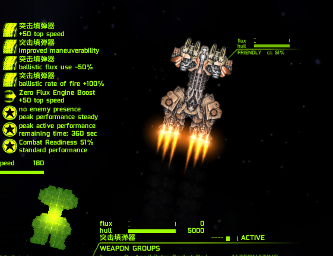
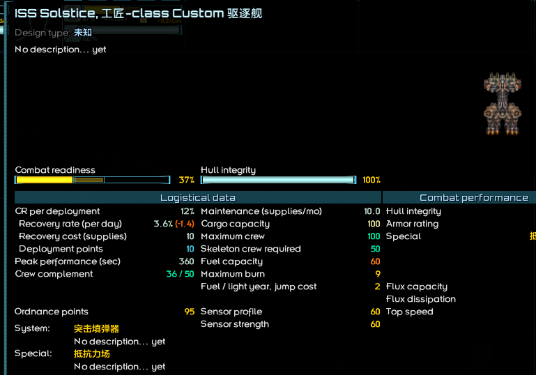
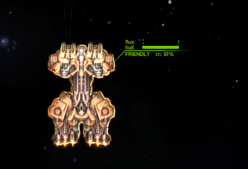

# 制作战术系统与右键战术系统

*本节预期阅读时间：~15 分钟。*

*本节预期操作时间：~15 分钟。*

## 制作战术系统文件

编者认为您应该已经非常熟悉复制、粘贴、修改的操作流程了。在当前阶段，编者建议您先从和原版类似的战术系统入手，先做相对简单的，等拥有一定程度的技术储备之后再做更为自定义化的。

在本例，编者将为此前的`工匠-级`制作一个叫`突击填弹器`新的战术系统，它很像`加速填弹器`，但在开启时还会额外提高一些速度。先将其翻译为英文`Assault Feed`，然后根据与舰船、武器类似的方式加上前缀名，形成它的战术系统 ID 为`GearIn_assaultfeed`。

然后将`加速填弹器`的`ammofeed.system`从原版专门用于存放战术系统的`data/shipsystems`文件夹内复制到 MOD 的同路径下，文件名改为`GearIn_assaultfeed.system`，开始修改：

```json
{
	"id":"ammofeed",
	"type":"STAT_MOD",
	"aiType":"WEAPON_BOOST",
	
	"statsScript":"data.shipsystems.scripts.AmmoFeedStats",
	
	"weaponGlowColor":[255,200,0,155],
	"weaponTypes":[BALLISTIC],
	
	"useSound":"system_ammo_feeder",
	"outOfUsesSound":"gun_out_of_ammo",
}
```

编者认为您一定会注意到`id`就是它的战术系统 ID，而下文的`statsScript`就是对应的效果代码路径。**您可能会注意到编者这次没有列出速查表**，因为战术系统的许多项目都与`type`相绑定，而可选项极多，因此不适合以速查表形式列出，更适合直接在需要时从原版的战术系统内复制而来。

修改战术系统最需要注意的就是`type`和`aiType`，前者决定了这个战术系统的运作方式，后者决定了它的默认 AI。

::: danger AI 行为注意

不同的`aiType`往往只能应用于它对应的那一种`type`上，否则将在舰船按下 U 的瞬间报错。

因此在后续进阶环节往往需要自行编写 AI。

:::

进行修改：

```json {2,6}
{
	"id":"GearIn_assaultfeed",
	"type":"STAT_MOD",
	"aiType":"WEAPON_BOOST",
	
	"statsScript":"data.shipsystems.scripts.GearIn_AssaultFeedStats",
	
	"weaponGlowColor":[255,200,0,155],
	"weaponTypes":[BALLISTIC],
	
	"useSound":"system_ammo_feeder",
	"outOfUsesSound":"gun_out_of_ammo",
}
```

修改`statsScript`是为了调整代码，因为编者预期的战术系统有不同的效果。在`shipsystems`文件夹内新建一个叫`scripts`的文件夹，然后将原版的`AmmoFeedStats.java`，复制到其中，并改名为`GearIn_AssaultFeedStats.java`。

::: tip 注意大小写

大小写很重要。

:::

然后打开文件，准备修改：

```java
package data.shipsystems.scripts;

import com.fs.starfarer.api.combat.MutableShipStatsAPI;
import com.fs.starfarer.api.impl.combat.BaseShipSystemScript;

public class AmmoFeedStats extends BaseShipSystemScript {

	public static final float ROF_BONUS = 1f;
	public static final float FLUX_REDUCTION = 50f;
	
	public void apply(MutableShipStatsAPI stats, String id, State state, float effectLevel) {
		
		float mult = 1f + ROF_BONUS * effectLevel;
		stats.getBallisticRoFMult().modifyMult(id, mult);
		stats.getBallisticWeaponFluxCostMod().modifyMult(id, 1f - (FLUX_REDUCTION * 0.01f));
		
//		ShipAPI ship = (ShipAPI)stats.getEntity();
//		ship.blockCommandForOneFrame(ShipCommand.FIRE);
//		ship.setHoldFireOneFrame(true);
	}
	public void unapply(MutableShipStatsAPI stats, String id) {
		stats.getBallisticRoFMult().unmodify(id);
		stats.getBallisticWeaponFluxCostMod().unmodify(id);
	}
	
	public StatusData getStatusData(int index, State state, float effectLevel) {
		float mult = 1f + ROF_BONUS * effectLevel;
		float bonusPercent = (int) ((mult - 1f) * 100f);
		if (index == 0) {
			return new StatusData("ballistic rate of fire +" + (int) bonusPercent + "%", false);
		}
		if (index == 1) {
			return new StatusData("ballistic flux use -" + (int) FLUX_REDUCTION + "%", false);
		}
		return null;
	}
}
```

简直令人眼花缭乱。但即使以外行的身份，可以做一些简单的解析：

```java
package data.shipsystems.scripts; // package 是当前路径

import com.fs.starfarer.api.combat.MutableShipStatsAPI; // 以 import 为开头的语句是导入，只有导入了对应接口，才能“做一些事”
import com.fs.starfarer.api.impl.combat.BaseShipSystemScript;

public class AmmoFeedStats extends BaseShipSystemScript { // AmmoFeedStats 和之前的文件名文件名相同，这里似乎要把它改成当前的文件名

	public static final float ROF_BONUS = 1f; // 先不用管 public static final 是什么意思，只需要注意到 float 是一种数字的意思就行。这里认为 ROF_BONUS 代表 1。float 数字的结尾往往必须带f。
	public static final float FLUX_REDUCTION = 50f; // 同上，一个叫 FLUX_REDUCTION 的东西代表 50
	
	public void apply(MutableShipStatsAPI stats, String id, State state, float effectLevel) {
		
		float mult = 1f + ROF_BONUS * effectLevel; // 似乎是在进行某种不为人知的计算
		stats.getBallisticRoFMult().modifyMult(id, mult); // 进行射速增益
		stats.getBallisticWeaponFluxCostMod().modifyMult(id, 1f - (FLUX_REDUCTION * 0.01f)); // 降低幅能产生
		
        // 诸如这种用 "//" 两个斜杠打头的行叫做 注释，注释 代码不会运行，您可以把它当做笔记
        // 所以下方的三行没有任何作用，可以忽视
//		ShipAPI ship = (ShipAPI)stats.getEntity();
//		ship.blockCommandForOneFrame(ShipCommand.FIRE);
//		ship.setHoldFireOneFrame(true);
	}
	public void unapply(MutableShipStatsAPI stats, String id) {
		stats.getBallisticRoFMult().unmodify(id); // 在战术系统结束后取消增益
		stats.getBallisticWeaponFluxCostMod().unmodify(id);
	}
	
	public StatusData getStatusData(int index, State state, float effectLevel) {
		float mult = 1f + ROF_BONUS * effectLevel;
		float bonusPercent = (int) ((mult - 1f) * 100f);
		if (index == 0) { // 据文字推断，也许是文字提示
			return new StatusData("ballistic rate of fire +" + (int) bonusPercent + "%", false);
		}
		if (index == 1) {
			return new StatusData("ballistic flux use -" + (int) FLUX_REDUCTION + "%", false);
		}
		return null;
	}
}
```

而刚才提到的加速功能和原版的`辅助推进器`十分相似。在找到`加速填弹器`代码相同的位置可以找到`辅助推进器`的代码文件`ManeuveringJetsStats.java`，打开检查：

```java
package data.shipsystems.scripts; // 也是路径

import com.fs.starfarer.api.Global; // 一些 import
import com.fs.starfarer.api.combat.MutableShipStatsAPI;
import com.fs.starfarer.api.combat.ShipAPI;
import com.fs.starfarer.api.combat.ShipEngineControllerAPI.ShipEngineAPI;
import com.fs.starfarer.api.impl.combat.BaseShipSystemScript;
import com.fs.starfarer.api.plugins.ShipSystemStatsScript;

public class ManeuveringJetsStats extends BaseShipSystemScript { // 也和文件名相同

	public void apply(MutableShipStatsAPI stats, String id, State state, float effectLevel) {
		if (state == ShipSystemStatsScript.State.OUT) { // 一些意义不明的判断
			stats.getMaxSpeed().unmodify(id); // to slow down ship to its regular top speed while powering drive down
			stats.getMaxTurnRate().unmodify(id);
		} else {
			stats.getMaxSpeed().modifyFlat(id, 50f); // 似乎是加成，比如加 50 速
			stats.getAcceleration().modifyPercent(id, 200f * effectLevel); // 似乎是机动性加成
			stats.getDeceleration().modifyPercent(id, 200f * effectLevel);
			stats.getTurnAcceleration().modifyFlat(id, 30f * effectLevel);
			stats.getTurnAcceleration().modifyPercent(id, 200f * effectLevel);
			stats.getMaxTurnRate().modifyFlat(id, 15f);
			stats.getMaxTurnRate().modifyPercent(id, 100f);
		}
		
		if (stats.getEntity() instanceof ShipAPI && false) { // 未知语句
			ShipAPI ship = (ShipAPI) stats.getEntity();
			String key = ship.getId() + "_" + id;
			Object test = Global.getCombatEngine().getCustomData().get(key);
			if (state == State.IN) {
				if (test == null && effectLevel > 0.2f) {
					Global.getCombatEngine().getCustomData().put(key, new Object());
					ship.getEngineController().getExtendLengthFraction().advance(1f);
					for (ShipEngineAPI engine : ship.getEngineController().getShipEngines()) {
						if (engine.isSystemActivated()) {
							ship.getEngineController().setFlameLevel(engine.getEngineSlot(), 1f);
						}
					}
				}
			} else {
				Global.getCombatEngine().getCustomData().remove(key);
			}
		}
	}
	public void unapply(MutableShipStatsAPI stats, String id) {
		stats.getMaxSpeed().unmodify(id); // 似乎是取消速度加成和机动性加成
		stats.getMaxTurnRate().unmodify(id); // 可以稍加推断，之前加成的项目都要在这里取消
		stats.getTurnAcceleration().unmodify(id);
		stats.getAcceleration().unmodify(id);
		stats.getDeceleration().unmodify(id);
	}
	
	public StatusData getStatusData(int index, State state, float effectLevel) {
		if (index == 0) { // 这里文字显然是启动时左下角的描述，那么 getStatusData 一定是用来控制文字描述的
			return new StatusData("improved maneuverability", false);
		} else if (index == 1) {
			return new StatusData("+50 top speed", false);
		}
		return null;
	}
}
```

虽然猜测很粗糙，但也八九不离十了。接下来要做的事情就是大胆地把需要的部分拼在一起，所以进行修改：

```java {6-9,11,22-33,39-43,56-60}
package data.shipsystems.scripts;

import com.fs.starfarer.api.combat.MutableShipStatsAPI;
import com.fs.starfarer.api.impl.combat.BaseShipSystemScript;

import com.fs.starfarer.api.Global; // 为避免少导了什么东西，import 应该同时包括这两者的
import com.fs.starfarer.api.combat.ShipAPI;
import com.fs.starfarer.api.combat.ShipEngineControllerAPI.ShipEngineAPI;
import com.fs.starfarer.api.plugins.ShipSystemStatsScript;

public class GearIn_AssaultFeedStats extends BaseShipSystemScript {

	public static final float ROF_BONUS = 1f;
	public static final float FLUX_REDUCTION = 50f;
	
	public void apply(MutableShipStatsAPI stats, String id, State state, float effectLevel) {
		
		float mult = 1f + ROF_BONUS * effectLevel;
		stats.getBallisticRoFMult().modifyMult(id, mult);
		stats.getBallisticWeaponFluxCostMod().modifyMult(id, 1f - (FLUX_REDUCTION * 0.01f));
		
		if (state == ShipSystemStatsScript.State.OUT) { 
			stats.getMaxSpeed().unmodify(id); // to slow down ship to its regular top speed while powering drive down
			stats.getMaxTurnRate().unmodify(id);
		} else {
			stats.getMaxSpeed().modifyFlat(id, 50f); 
			stats.getAcceleration().modifyPercent(id, 200f * effectLevel);
			stats.getDeceleration().modifyPercent(id, 200f * effectLevel);
			stats.getTurnAcceleration().modifyFlat(id, 30f * effectLevel);
			stats.getTurnAcceleration().modifyPercent(id, 200f * effectLevel);
			stats.getMaxTurnRate().modifyFlat(id, 15f);
			stats.getMaxTurnRate().modifyPercent(id, 100f);
		}
	}
	public void unapply(MutableShipStatsAPI stats, String id) {
		stats.getBallisticRoFMult().unmodify(id);
		stats.getBallisticWeaponFluxCostMod().unmodify(id);
        
        stats.getMaxSpeed().unmodify(id);
		stats.getMaxTurnRate().unmodify(id);
		stats.getTurnAcceleration().unmodify(id);
		stats.getAcceleration().unmodify(id);
		stats.getDeceleration().unmodify(id);
	}
	
	public StatusData getStatusData(int index, State state, float effectLevel) {
		float mult = 1f + ROF_BONUS * effectLevel;
		float bonusPercent = (int) ((mult - 1f) * 100f);
		if (index == 0) {
			return new StatusData("ballistic rate of fire +" + (int) bonusPercent + "%", false);
		}
		if (index == 1) {
			return new StatusData("ballistic flux use -" + (int) FLUX_REDUCTION + "%", false);
		}
        
        if (index == 2) { // 依葫芦画瓢，上面是 0 和 1 那么这里就改成 2 和 3
			return new StatusData("improved maneuverability", false);
		} else if (index == 3) {
			return new StatusData("+50 top speed", false);
		}
		return null;
	}
}
```

这就做好了。在不清楚原理的初学者阶段，建议保持最小触动原则。

## 制作战术系统数据

战术系统数据储存在`data/shipsystems`文件夹内的`ship_systems.csv`里，框架已经提供了这个文件。

编者相信您此时已经开始打开原版的`ship_systems.csv`并且把`加速填弹器`的那一行复制过来并调整了`id`和`name`，毕竟您应该已经对这两个项目产生条件反射了：

```csv {5}
name,id,flux/second,f/s (base rate),f/s (base cap),flux/use,f/u (base rate),f/u (base cap),cr/u,max uses,regen,charge up,active,down,cooldown,toggle,noDissipation,noHardDissipation,hardFlux,noFiring,noTurning,noStrafing,noAccel,noShield,noVent,isPhaseCloak,tags,icon
,,,,,,,,,,,,,,,,,,,,,,,,,,,
#Burn Drive,burndrive,1,,,,,,,,,2,5,1,10,TRUE,,,,,TRUE,TRUE,TRUE,TRUE,,,,graphics/icons/hullsys/burn_drive.png
,,,,,,,,,,,,,,,,,,,,,,,,,,,
突击填弹器,GearIn_assaultfeed,,,,,,,,,,1,5,1,10,,,,,,,,,,,,,graphics/icons/hullsys/ammo_feeder.png
```

### 实用战术系统数据速查表

| 英文              | 实际意义                                                     |
| ----------------- | ------------------------------------------------------------ |
| name              | 战术系统的名称                                               |
| id                | 战术系统 ID                                                  |
| flux/second       | 战术系统每秒产生的幅能数量                                   |
| f/s (base rate)   | 战术系统每秒产生的幅能数量与舰船基础耗散速率的比率，与`flux/second`可共同作用 |
| f/s (base cap)    | 战术系统每秒产生的幅能数量与舰船基础幅能容量的比率，与`flux/second`、`f/s (base rate)`可共同作用 |
| flux/use          | 战术系统每次启动产生的幅能数量                               |
| f/u (base rate)   | 战术系统每次启动产生的幅能数量与舰船基础耗散速率的比率，与`flux/use`可共同作用 |
| f/u (base cap)    | 战术系统每次启动产生的幅能数量与舰船基础耗散速率的比率，与`flux/use`、`f/u (base rate)`可共同作用 |
| cr/u              | 战术系统每次启动所消耗的 CR                                  |
| max uses          | 战术系统充能次数，不填为无限                                 |
| regen             | 在`max uses`有限的情况下启动，充能次数的恢复速率，单位是 次/秒，不填则为不可恢复 |
| charge up         | 前摇时长。战术系统前摇时往往也有效果，从无到渐强             |
| active            | 全功率激活时长                                               |
| down              | 后摇时长。战术系统后摇时往往也有效果，从全到渐弱             |
| cooldown          | 冷却时长。                                                   |
| toggle            | 设为 TRUE 时，战术系统将变为开关式的。默认为 FALSE           |
| noDissipation     | 设为 TRUE 时，战术系统启动时无法耗散幅能。默认为 FALSE       |
| noHardDissipation | 设为 TRUE 时，战术系统启动时无法耗散硬幅能。默认为 FALSE     |
| hardFlux          | 设为 TRUE 时，战术系统产生的幅能为硬幅能，否则为软幅能。默认为 FALSE |
| noFiring          | 设为 TRUE 时，战术系统启动时无法开火。默认为 FALSE           |
| noTurning         | 设为 TRUE 时，战术系统启动时无法转向。默认为 FALSE           |
| noStrafing        | 设为 TRUE 时，战术系统启动时无法左右平移。默认为 FALSE       |
| noAccel           | 设为 TRUE 时，战术系统启动时无法向前加速。默认为 FALSE       |
| noShield          | 设为 TRUE 时，战术系统启动时无法启动护盾或右键战术系统。默认为 FALSE |
| noVent            | 设为 TRUE 时，战术系统启动时无法按 V 排散。默认为 FALSE      |
| isPhaseCloak      | 设为 TRUE 时，战术系统被认为是一种相位，虽然实际上未必有相位效果。默认为 FALSE |
| tags              | 进阶内容，可随意编纂，原版范畴内仅`restricted`和`uses_damper_ai` |
| icon              | 战术系统的图标贴图路径                                       |

## 战术系统实装

编者认为`突击填弹器`的效果非常强力，可以让它的前摇和持续时间缩短一些，来提供机会操作手感，让它变得不那么无聊。

打开`ship_data.csv`，进行修改：

```csv {16}
name,id,designation,tech/manufacturer,system id,fleet pts,hitpoints,armor rating,max flux,8/6/5/4%,flux dissipation,ordnance points,fighter bays,max speed,acceleration,deceleration,max turn rate,turn acceleration,mass,shield type,defense id,shield arc,shield upkeep,shield efficiency,phase cost,phase upkeep,min crew,max crew,cargo,fuel,fuel/ly,range,max burn,base value,cr %/day,CR to deploy,peak CR sec,CR loss/sec,supplies/rec,supplies/mo,c/s,c/f,f/s,f/f,crew/s,crew/f,hints,tags,rarity,breakProb,minPieces,maxPieces,travel drive,number
,,,,,,,,,,,,,,,,,,,,,,,,,,,,,,,,,,,,,,,,,,,,,,,,,,,,,
#Lasher,lasher,Frigate,Low Tech,ammofeed,5,1750,300,2100,1750,140,55,,120,110,90,60,90,200,FRONT,,210,0.4,1,,,25,50,40,25,1,25,10,9000,8,10,240,0.25,4,4,,,,,,,,"lowtech_bp, merc",,0.4,2,2,,204
,,,,,,,,,,,,,,,,,,,,,,,,,,,,,,,,,,,,,,,,,,,,,,,,,,,,,
#Hammerhead,hammerhead,Destroyer,Midline,ammofeed,10,5000,500,4200,4167,250,95,,90,60,40,30,60,400,FRONT,,300,0.4,0.8,,,50,100,100,60,2,30,9,40000,5,12,360,0.25,10,10,,,,,,,,"midline_bp, merc",,0.5,2,3,,300
,,,,,,,,,,,,,,,,,,,,,,,,,,,,,,,,,,,,,,,,,,,,,,,,,,,,,
#Eagle,eagle,Cruiser,Midline,maneuveringjets,14,8000,1000,11000,12000,600,155,,50,30,20,15,20,1200,FRONT,,270,0.4,0.8,,,150,250,150,100,3,33,8,120000,3,12,480,0.25,22,22,,,,,,,,"rare_bp, merc",,0.5,2,3,,401
,,,,,,,,,,,,,,,,,,,,,,,,,,,,,,,,,,,,,,,,,,,,,,,,,,,,,
#Conquest,conquest,Battlecruiser,Midline,maneuveringjets,24,12000,1200,20000,30000,1200,315,,45,20,15,6,4,2500,OMNI,,90,0.4,1.4,,,400,500,300,300,10,30,8,300000,3,15,600,0.25,40,40,,,,,,,,"rare_bp, merc",,0.5,2,4,,503
,,,,,,,,,,,,,,,,,,,,,,,,,,,,

炉渣,GearIn_slag,,未知,flarelauncher_fighter,,750,100,200,,100,0,,180,400,350,90,180,30,NONE,,0,0,0,,,1,1,,,,,,,,,,,,,,,,,,,,,,0,,,,104

锻件,GearIn_forging,相位护卫舰,未知,ammofeed,6,2000,350,1200,2000,100,35,,90,120,90,45,90,200,PHASE,phasecloak,90,,,0.075,0.075,4,10,10,20,1,20,9,26000,10,20,180,0.25,6,6,,,,,,,PHASE,base_bp,,0.5,2,2,,228

工匠,GearIn_artizan,驱逐舰,未知,GearIn_assaultfeed,10,5000,500,3800,4167,200,95,,80,60,40,30,60,400,FRONT,,300,0.4,0.8,,,50,100,100,60,2,30,9,40000,5,12,360,0.25,10,10,,,,,,,,"midline_bp, merc",,0.5,2,3,,300
看炉人,GearIn_furnaceman,轻型航母,未知,targetingfeed,11,4500,400,3000,2813,225,75,2,75,50,30,25,25,450,FRONT,,300,0.4,0.8,,,90,150,40,40,2,20,9,52000,5,15,360,0.25,13,13,,,,,,,CARRIER,"midline_bp, merc",,0.5,2,3,,318

```

如果您在这个过程中没有忘了保存或打错字或填错东西或看错格子...

那您就可以在游戏中使用您自己的战术系统了。



## 制作非相位右键战术系统

**编者建议您目前阶段只设计防御型右键战术系统，因为您现在可能并没有编写 AI 的能力**，而原版当前支持非相位右键战术系统的 AI 只有`阻尼力场`。强行设计其它类型的右键战术系统会导致它在游戏内难以被 AI 理解，强行套用其它 AI 更是会直接让游戏报错。

在本例，编者将设计一种`抵抗力场`，大致上是`阻尼力场`的调整版，让它更倾向于抵抗高爆伤害，战术系统 ID 为`GearIn_resistfield`。将原版的`damper.system`复制并修改文件名为`GearIn_resistfield.system`，内容调整为如下：

```json {2,6}
{
	"id":"GearIn_resistfield",
	"type":"STAT_MOD",
	"aiType":"DAMPER_FIELD",
	
	"statsScript":"data.shipsystems.scripts.GearIn_ResistFieldStats",
	
	"jitterUnderColor":[255,165,90,155],
	"jitterUnderCopies":25,
	"jitterUnderMinRange":0,
	"jitterUnderRange":7,
	"jitterUnderRangeRadiusFraction":0,
	
	"jitterColor":[255,165,90,55],
	"jitterCopies":2,
	"jitterMinRange":0,
	"jitterRange":5,
	"jitterRangeRadiusFraction":0,
	
	#"weaponGlowColor":[255,165,90,0],
	#"weaponTypes":[ENERGY, BALLISTIC, MISSILE],
	
	#"engineGlowColor":[255,90,255,255],
	
	"soundFilterType":"LOWPASS",
	"soundFilterGain":0.75,
	"soundFilterGainHF":0.25,

	"fadeActivationSoundOnChargedown":true,
	"useSound":"system_damper",
	"loopSound":"system_damper_loop",
	"deactivateSound":"system_damper_off",
	"outOfUsesSound":"gun_out_of_ammo",
	
	"aiHints":{
	}
}
```

然后是`scripts`文件夹里的`GearIn_ResistFieldStats.java`：

```java
package data.shipsystems.scripts;

import com.fs.starfarer.api.combat.MutableShipStatsAPI;
import com.fs.starfarer.api.impl.combat.BaseShipSystemScript;

public class GearIn_ResistFieldStats extends BaseShipSystemScript {

	public static final float HE_REDUCTION = 75f;
	public static final float EMP_REDUCTION = 75f;
	public static final float OTHER_REDUCTION = 50f;
	
	public void apply(MutableShipStatsAPI stats, String id, State state, float effectLevel) {

		stats.getHighExplosiveDamageTakenMult().modifyMult(id, 1f - HE_REDUCTION * 0.01f * effectLevel);
		stats.getKineticDamageTakenMult().modifyMult(id, 1f - OTHER_REDUCTION * 0.01f * effectLevel);
		stats.getEnergyDamageTakenMult().modifyMult(id, 1f - OTHER_REDUCTION * 0.01f * effectLevel);
		stats.getEmpDamageTakenMult().modifyMult(id, 1f - EMP_REDUCTION * 0.01f * effectLevel);

	}
	public void unapply(MutableShipStatsAPI stats, String id) {

		stats.getHighExplosiveDamageTakenMult().unmodify(id);
		stats.getKineticDamageTakenMult().unmodify(id);
		stats.getEnergyDamageTakenMult().unmodify(id);
		stats.getEmpDamageTakenMult().unmodify(id);
	}
	
	public StatusData getStatusData(int index, State state, float effectLevel) {
		if (index == 0) {
			return new StatusData("reduce damage taken", false);
		}
		return null;
	}
}
```

以及在`ship_systems.csv`里加上从`阻尼力场`抄过来小修小改的一行：

```csv {6}
name,id,flux/second,f/s (base rate),f/s (base cap),flux/use,f/u (base rate),f/u (base cap),cr/u,max uses,regen,charge up,active,down,cooldown,toggle,noDissipation,noHardDissipation,hardFlux,noFiring,noTurning,noStrafing,noAccel,noShield,noVent,isPhaseCloak,tags,icon
,,,,,,,,,,,,,,,,,,,,,,,,,,,
#Burn Drive,burndrive,1,,,,,,,,,2,5,1,10,TRUE,,,,,TRUE,TRUE,TRUE,TRUE,,,,graphics/icons/hullsys/burn_drive.png
,,,,,,,,,,,,,,,,,,,,,,,,,,,
突击填弹器,GearIn_assaultfeed,,,,,,,,,,0.5,3,1,10,,,,,,,,,,,,,graphics/icons/hullsys/ammo_feeder.png
抵抗力场,GearIn_resistfield,1,,,,,,,2,0.05,0.25,3,0.25,0,,,,,TRUE,,,,TRUE,TRUE,,uses_damper_ai,graphics/icons/hullsys/damper_field.png
```

注意`抵抗力场`/`阻尼力场`的`tags`不为空，而是`uses_damper_ai`。

因为实在没有什么新的载体，所以编者打算直接让`工匠-级`驱逐舰搭载它。将护盾替换为`PHASE`，并按前文的解释填上右键防御系统的 ID：

```csv {16}
name,id,designation,tech/manufacturer,system id,fleet pts,hitpoints,armor rating,max flux,8/6/5/4%,flux dissipation,ordnance points,fighter bays,max speed,acceleration,deceleration,max turn rate,turn acceleration,mass,shield type,defense id,shield arc,shield upkeep,shield efficiency,phase cost,phase upkeep,min crew,max crew,cargo,fuel,fuel/ly,range,max burn,base value,cr %/day,CR to deploy,peak CR sec,CR loss/sec,supplies/rec,supplies/mo,c/s,c/f,f/s,f/f,crew/s,crew/f,hints,tags,rarity,breakProb,minPieces,maxPieces,travel drive,number
,,,,,,,,,,,,,,,,,,,,,,,,,,,,,,,,,,,,,,,,,,,,,,,,,,,,,
#Lasher,lasher,Frigate,Low Tech,ammofeed,5,1750,300,2100,1750,140,55,,120,110,90,60,90,200,FRONT,,210,0.4,1,,,25,50,40,25,1,25,10,9000,8,10,240,0.25,4,4,,,,,,,,"lowtech_bp, merc",,0.4,2,2,,204
,,,,,,,,,,,,,,,,,,,,,,,,,,,,,,,,,,,,,,,,,,,,,,,,,,,,,
#Hammerhead,hammerhead,Destroyer,Midline,ammofeed,10,5000,500,4200,4167,250,95,,90,60,40,30,60,400,FRONT,,300,0.4,0.8,,,50,100,100,60,2,30,9,40000,5,12,360,0.25,10,10,,,,,,,,"midline_bp, merc",,0.5,2,3,,300
,,,,,,,,,,,,,,,,,,,,,,,,,,,,,,,,,,,,,,,,,,,,,,,,,,,,,
#Eagle,eagle,Cruiser,Midline,maneuveringjets,14,8000,1000,11000,12000,600,155,,50,30,20,15,20,1200,FRONT,,270,0.4,0.8,,,150,250,150,100,3,33,8,120000,3,12,480,0.25,22,22,,,,,,,,"rare_bp, merc",,0.5,2,3,,401
,,,,,,,,,,,,,,,,,,,,,,,,,,,,,,,,,,,,,,,,,,,,,,,,,,,,,
#Conquest,conquest,Battlecruiser,Midline,maneuveringjets,24,12000,1200,20000,30000,1200,315,,45,20,15,6,4,2500,OMNI,,90,0.4,1.4,,,400,500,300,300,10,30,8,300000,3,15,600,0.25,40,40,,,,,,,,"rare_bp, merc",,0.5,2,4,,503
,,,,,,,,,,,,,,,,,,,,,,,,,,,,

炉渣,GearIn_slag,,未知,flarelauncher_fighter,,750,100,200,,100,0,,180,400,350,90,180,30,NONE,,0,0,0,,,1,1,,,,,,,,,,,,,,,,,,,,,,0,,,,104

锻件,GearIn_forging,相位护卫舰,未知,ammofeed,6,2000,350,1200,2000,100,35,,90,120,90,45,90,200,PHASE,phasecloak,90,,,0.075,0.075,4,10,10,20,1,20,9,26000,10,20,180,0.25,6,6,,,,,,,PHASE,base_bp,,0.5,2,2,,228

工匠,GearIn_artizan,驱逐舰,未知,GearIn_assaultfeed,10,5000,500,3800,4167,200,95,,80,60,40,30,60,400,PHASE,GearIn_resistfield,,,,0.1,0,50,100,100,60,2,30,9,40000,5,12,360,0.25,10,10,,,,,,,,"midline_bp, merc",,0.5,2,3,,300
看炉人,GearIn_furnaceman,轻型航母,未知,targetingfeed,11,4500,400,3000,2813,225,75,2,75,50,30,25,25,450,FRONT,,300,0.4,0.8,,,90,150,40,40,2,20,9,52000,5,15,360,0.25,13,13,,,,,,,CARRIER,"midline_bp, merc",,0.5,2,3,,318
```





## 制作相位右键战术系统？

相位右键战术系统和非相位右键战术系统并没有本质差别，无非是带相位的要将`isPhased`设为 True 且它的代码文件里把舰船设为相位状态而已。如果您需要了解更多能对舰船执行的操作，还请等待后文。
