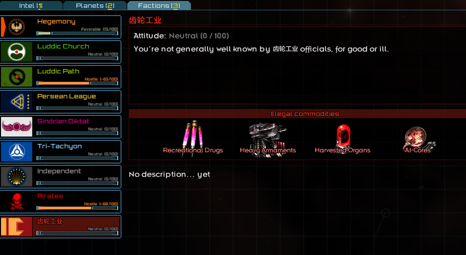

# 制作新常规势力

*本节预期阅读时间：~15 分钟。*

*本节预期操作时间：~10 分钟。*

## 制作新势力文件

编者相信您应该已经猜到编者接下来要干什么了。

从`data/world/factions`文件夹中复制`hegemony.faction`文件到 MOD 的同路径下，并更名为`gear_industry.faction`。在本例中，`齿轮工业`将以`霸主`为基础修改而来。打开文件，准备进行修改：

```json
{
	id:"hegemony", # 势力的id
	"color":[245,150,30,255], # 势力的颜色
	"displayName":"Hegemony", # 势力的名称
	"displayNameWithArticle":"the Hegemony", # 势力的名称，在中文环境下，应当与 displayName 一致
	"logo":"graphics/factions/hegemony.png", # 势力的旗帜贴图路径，贴图大小应该是 410*256
	"crest":"graphics/factions/crest_hegemony.png", # 势力的短旗帜贴图路径，贴图大小应该是 256*256
	"shipNamePrefix":"HSS", # 势力的舰船前缀，大写英文字母，可随意编写
	"shipNameSources":{ # 势力的舰船名词典，详见 starsector-core/data/strings/ship_names
		"HEGEMONY":1,
		"BRITISH_NAVY":1,
		"ROMAN":2,
		"GREEK":1,
		"SPACE":1,
		"GENERAL":1,
	},
	"names":{ # 势力的人名词典，详见 starsector-core/data/characters
		"old english":1,
		"modern":1,
		"world":1,
		"future":1,
		"myth":1,
	},
	
	# variantOverrides restricts hulls to listed variants and adjusts their probability
	"variantOverrides":{
	},
	
	# multiplier for how often hulls show up in the faction's fleets
	"hullFrequency":{ # 势力的舰船出现概率调整
		"tags":{
			"heg_aux_bp":2, # 船体 ID : 出现倍率
			"XIV_bp":0.25,
		},
		"hulls":{
			"buffalo2":0, # 出现倍率设为 0 则为不出现
		},
	},
	# ships the faction gets access to when importing S&W out-of-faction
	"shipsWhenImporting":{ # 势力的持入舰船
		"tags":["base_bp", "heg_aux_bp", "lowtech_bp"], # 请尤其注意这个 tags 的内容
		"hulls":[
		],
	},
	"knownShips":{ # 势力的舰船列表
		"tags":["base_bp", "heg_aux_bp", "lowtech_bp", "midline_bp", "XIV_bp", "hegemony"], # 请尤其注意这个 tags 的内容
		"hulls":[
			"atlas",
			"monitor",
			"prometheus",
			"legion",
			"onslaught",
			"gryphon",
			"eagle",
			"valkyrie",
			"vanguard",
			"manticore",
		],
	},
	# listing ships here will make the faction mostly use them even if other hulls become available
	"priorityShips":{ # 优先选用的舰船，会显著覆盖本势力其它舰船的出现率，如无特殊要求则留空
		"tags":[],
		"hulls":[
			"condor",
			"mora",
			"legion",
			"onslaught",
			"onslaught_xiv",
		],
	},
	"knownFighters":{ # 势力的战机列表
		"tags":["base_bp", "lowtech_bp", "midline_bp", "hegemony"], # 请尤其注意这个 tags 的内容
		"fighters":[
			"thunder_wing",
			"hoplon_wing",
		],
	},
	"priorityFighters":{ # 优先选用的战机，会显著覆盖本势力其它战机的出现率，如无特殊要求则留空
		"tags":[],
		"fighters":[
		],
	},
	"knownWeapons":{ # 势力的武器列表
		"tags":["base_bp", "lowtech_bp", "midline_bp", "hightech_bp", "missile_bp", "hegemony"], # 请尤其注意这个 tags 的内容
		"weapons":[
			"railgun",
			"dualflak",
			"heavymauler",
			"hveldriver",
			"gauss",
			"mjolnir",
			"breachpod",
			"sabotpod",
			"phasecl",
			"cyclone",
			"hurricane",
		],
	},
	"priorityWeapons":{ # 优先选用的武器，会显著覆盖本势力其它武器的出现率，如无特殊要求则留空
		"tags":[],
		"weapons":[
		],
	},
	"knownHullMods":{ # 势力的舰船插件列表
		"tags":["base_bp", "hegemony"], # 请尤其注意这个 tags 的内容
		"hullMods":[
			"advancedshieldemitter",
			"turretgyros",
			"armoredweapons",
			"augmentedengines",
			"autorepair",
			"expanded_deck_crew",
			"magazines",
			"missleracks",
			"extendedshieldemitter",
			"frontemitter",
			"frontshield",
			"heavyarmor",
			"insulatedengine",
			"targetingunit",
			"nav_relay",
			"operations_center",
			"fluxbreakers",
			"stabilizedshieldemitter",
			"frontshield",  # makeshift
			"surveying_equipment",
			"efficiency_overhaul",
			"converted_fighterbay",
			"ballistic_rangefinder",
			"shield_shunt",
		],
	},
	"factionDoctrine":{ # 势力的舰队学说设置，与游戏内玩家自创势力相同
        # 下列三条的总合建议为 7，不应该低于 1
		"warships":4, # 通常战舰占比
		"carriers":2, # 航母占比
		"phaseShips":1, # 相位舰占比
		
        # 下列三条的总合建议为 7，不应该低于 1
		"officerQuality":5, # 军官质量(影响等级、精英技能数)加成
		"shipQuality":1, # 舰船质量(影响D插比率)加成
		"numShips":1, # 舰船数量加成
		
		"shipSize":4, # 舰船大小倾向，越大越倾向于使用战列舰，最大为 5，不应该低于 1
		
		"aggression":2, # 军官性格倾向，越大越倾向于全鲁莽，最大为 5，不应该低于 1
		
		"combatFreighterProbability":0.1, # 用武装货舰替代正常货舰的概率
		"combatFreighterCombatUseFraction":0, # 当舰队损失至低于此比率时，才将武装货舰当正规战舰上场
		"combatFreighterCombatUseFractionWhenPriority":0, # 用武装货舰当正规战舰上场的概率(哪怕自己不缺的正规战舰)
		"autofitRandomizeProbability":0.1, # 自动装配时的武器、插件打乱程度
		
		"commanderSkillsShuffleProbability":1,
		"commanderSkills":[ # 本势力允许的指挥官舰队技能
			"crew_training",
			"officer_training",
			"coordinated_maneuvers",
			"support_doctrine",
		],
	},
	"illegalCommodities":[ # 违禁品，在data/campaign/commodity.csv
		"drugs", # 非常不建议干出例如把重型武器或者补给作为违禁品的事情
		"organs",
		"hand_weapons",
		"ai_cores",	
	],
	"music":{ # 音乐
		"theme":"music_hegemony_market_neutral",
		"market_neutral":"music_hegemony_market_neutral",
		"market_hostile":"music_hegemony_market_hostile",
		"market_friendly":"music_hegemony_market_friendly",
		"encounter_neutral":"music_hegemony_encounter_neutral",
		"encounter_hostile":"music_hegemony_encounter_hostile",
		"encounter_friendly":"music_hegemony_encounter_friendly",
	},	
	"internalComms":"hegemony_internal",
	#"tariffFraction":0.4, # 去掉最前方的 # 启用，税率，非常建议无视
	#"tollFraction":0.1, # 去掉最前方的 # 启用，扫描玩家货舱后损毁CR的运算参数之一，非常建议无视
	#"fineFraction":0.25, # 去掉最前方的 # 启用，扫描玩家货舱后损毁CR的运算参数之一，非常建议无视
	"portraits":{
		"standard_male":[ # 头像，男性
			"graphics/portraits/portrait_hegemony01.png",
			"graphics/portraits/portrait_hegemony02.png",
			"graphics/portraits/portrait_hegemony05.png",
			"graphics/portraits/portrait_hegemony07.png",
			"graphics/portraits/portrait_hegemony09.png",
			"graphics/portraits/portrait_hegemony12.png",
			"graphics/portraits/portrait_hegemony13.png",
			"graphics/portraits/portrait_hegemony15.png",
			"graphics/portraits/portrait_mercenary03.png",
			"graphics/portraits/portrait_mercenary06.png",
			"graphics/portraits/portrait_mercenary08.png",
			"graphics/portraits/portrait15.png",
			"graphics/portraits/portrait33.png",
		],
		"standard_female":[ # 头像，女性
			"graphics/portraits/portrait_hegemony03.png",
			"graphics/portraits/portrait_hegemony04.png",
			"graphics/portraits/portrait_hegemony08.png",
			"graphics/portraits/portrait_hegemony10.png",
			"graphics/portraits/portrait_hegemony11.png",
			"graphics/portraits/portrait_hegemony14.png",
			"graphics/portraits/portrait_hegemony16.png",
			"graphics/portraits/portrait16.png",
			"graphics/portraits/portrait22.png",
			"graphics/portraits/portrait34.png",
			"graphics/portraits/portrait37.png",
			"graphics/portraits/portrait42.png",
		],
	},
	"ranks":{
		"ranks":{ # 各类 rank 的自定义名称，若不需要可以整行删去，删去则为使用原版的默认名
			"factionLeader":{"name":"High Hegemon"},
			"spaceCommander":{"name":"Commander"},
		},
		"posts":{
			"factionLeader":{"name":"High Hegemon"},
			"patrolCommander":{"name":"Patrol Commander"},
			"fleetCommander":{"name":"Fleet Commander"},
			"baseCommander":{"name":"Base Commander"},
		},
	},
	"voices":{ # 势力产生的联络人的类型分配比率，根据低、中、高重要性可以各自不同设计
		"LOW":{ # 低重要性
			"soldier":10, # 类型:权重
			"faithful":5,		
			"spacer":5,
		},
		"MEDIUM":{ # 中重要性
			"soldier":10,
			"official":5,
		},
		"HIGH":{ # 高重要性
			"soldier":5,
			"official":10,
			"aristo":3,
		},
		# 所有可用的 voice(类型) 有
		# spacer 寻常船员
		# faithful 卢德信徒
		# pather 左径狂信徒
		# business 星际商人
		# official 政务官员
		# soldier 下级士兵
		# scientist 科学家
		# villain 海盗军阀
		# aristo 旧式贵族
	"custom":{
		"offersCommissions":true, # 是否发布雇佣协议
		"engagesInHostilities":true, # 是否敌对时主动攻击
		"buysAICores":true, # 是否收购ai核心
		"AICoreValueMult":1, # 收购ai核心的价格倍率，1就是默认，2就是翻倍，允许小数
		"AICoreRepMult":2, # 收购ai核心的关系倍率，1就是默认，2就是翻倍，允许小数
		"buysSurveyData":true, # 是否会发布调查数据任务
		"hostilityImpactOnGrowth":true, # 无效果，无视之
		"caresAboutAtrocities":true, # 是否对饱和轰炸进行谴责
        
        "engageWhenEvenStrength":true, # 是否在敌人比较强时也主动触发舰队战斗
		"decentralized":true, # 去中心化，让该势力相关的某些赏金任务更不容易发现玩家的身份，且影响某些内核代码判定。诸如自由联盟、海盗的势力应当设为 true
		"gaVIPMission":false, # 有 Galatia 学院的 VIP 任务，极度极度不建议设为 true
		"postsNoBounties":true, # 如果设为 true，则不主动发布势力赏金
		"offerMissionsWhenHostile":true, # 是否在和玩家敌对时也对玩家发布任务
		"allowsTransponderOffTrade":true, # 是否允许关闭应答器交易
		"patrolsHaveNoPatrolMemoryKey":true, # 如果设为 true，则该势力的巡逻队在代码机制上不被认为是巡逻队
		"pirateBehavior":true, # 是否是海盗型势力
		"makesPirateBases":true, # 是否会虚空创造基地，如同海盗那样
		"fightToTheLast":true, # 是否在战斗中大多数船都会死战不退
        
		"punitiveExpeditionData":{
			"vsCompetitors":false, # 是否对商业竞争发动远征
			"vsFreePort":true, # 是否对自由港发动远征
			"canBombard":false, # 能否在发动远征时顺带进行轰炸
			"territorial":true, # 是否对星系内的其它势力获得额外远征机会
		},
	},	
	
	
},
```

由于 faction 型文件实在过长，不便于以表格形式列出，因此编者以注释形式注解了所有有意义且适合初学者调整的项目，您可以因情况自行修改。

::: tip bp 的作用

编者曾建议您为您制作的舰船、战机、武器填写一些似乎意义不明的`前缀名_bp`，在本例为`GearIn_bp`。

现在它们将产生作用。您只需要在`known_*`对应的`tags`内写上您的`前缀名_bp`，即可自动导入势力舰船、战机、武器。

:::

::: tip 为势力安排武器和战机

您未必能脱离原版武器库与战机库来形成您势力的军备，因此不建议删除所有武器方面的导入。

:::

最后在同目录下的`factions.csv`中注册势力，别忘了删除前方的`#`号：

```csv {2}
faction
data/world/factions/gear_idustry.faction
```



它已经大致完成了，但还需要一些微小的工作。

### 将装配文件导入生涯

同目录下还有一个`default_ship_roles.json`文件，它是用于将装配导入生涯的。如果没有设置这个文件，那么您的势力将无法调用您在上一阶段制作的舰船装配。**打开`default_ship_roles.json`，参考原版同路径下的文件进行修改**。

## 实用势力包(bp)与其它生成型 tags 速查表

**不在本表上的数据均为与势力包(bp)和生成均无关的 tags。**

| 英文             | 实际意义                                                     |
| ---------------- | ------------------------------------------------------------ |
| base_bp          | 玩家初始势力包，且绝大多数势力都拥有                         |
| lowtech_bp       | 低科势力包，**不是所有低科武器/舰船都在其中**。原版拥有它的势力是：霸主、自由联盟(与拾荒者)、英仙座联盟、辛达强权、卢德教会、卢德左径(仅武器) |
| midline_bp       | 中科势力包，**不是所有中科武器/舰船都在其中**。原版拥有它的势力是：霸主、自由联盟(与拾荒者)、英仙座联盟、辛达强权、卢德教会(仅武器)、卢德左径(仅武器) |
| hightech_bp      | 高科势力包，**不是所有高科武器/舰船都在其中**。原版拥有它的势力是：自由联盟(与拾荒者)、英仙座联盟、辛达强权、速子科技、卢德教会(仅武器)、卢德左径(仅武器) |
| heg_aux_bp       | 霸主辅助军(A)型改造包，只有霸主拥有它                        |
| XIV_bp           | 第十四军团(XIV)蓝图包，只有霸主拥有它                        |
| hegemony         | 霸主势力包                                                   |
| independent      | 自由联盟势力包                                               |
| persean          | 英仙座联盟势力包                                             |
| tritachyon       | 速子科技势力包                                               |
| scavenger        | 拾荒者(在野外刷出的自由联盟舰船使用此类型)势力包             |
| luddic_church    | 卢德教会势力包                                               |
| luddic_path      | 卢德左径势力包                                               |
| LP_bp            | 左径安超(LP)型改造包，只有卢德左径拥有它                     |
| lions_guard      | 狮心守卫(辛达强权的少量特殊舰队使用此类型)势力包             |
| sindrian_diktat  | 辛达强权势力包                                               |
| pirates          | 海盗势力包                                                   |
| derelict         | 遗弃船(绿粽子)势力包                                         |
| remnant          | 余晖势力包                                                   |
| omega            | 欧米伽势力包                                                 |
| merc             | 精英佣兵包，可以被游戏中自由联盟生成的*万国牌多 S 插超豪华佣兵*使用。 |
| rare_bp          | 稀有包，所有势力都默认不拥有它。它不是用来控制势力生成，而是让拥有这个 tag 的组件可在野外被打捞或挖坟得出 |
| restricted       | 限制级，所有势力都默认不拥有它。它将默认不出现在数据库与绝大多数场合，适合用于隐藏数据 |
| no_drop          | 不会在战后掉落                                               |
| no_drop_salvage  | 不会在残骸区打捞得到                                         |
| no_sell          | 不会在市场出售                                               |
| no_dealer        | 不会被联络人任务提供                                         |
| hist1t           | 与历史学家相关，带有此 tag 的组件会被历史学家提供蓝图位置。在历史学家池里的稀有度较低 |
| hist2t           | 与历史学家相关，带有此 tag 的组件会被历史学家提供蓝图位置。在历史学家池里的稀有度较高 |
| hist3t           | 与历史学家相关，带有此 tag 的组件会被历史学家提供蓝图位置。在历史学家池里的稀有度最高 |
| 没有hist4t或更高 |                                                              |

