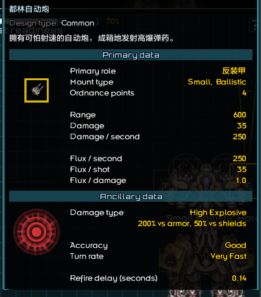
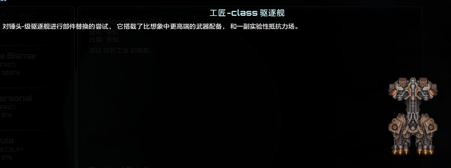
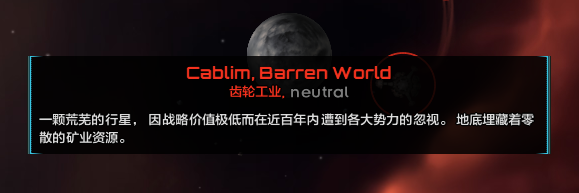

# 文本补充

*本节预期阅读时间：~5 分钟。*

*本节预期操作时间：~20 分钟。*

## description 文件解析

绝大多数前文未介绍过的文本都在`data/strings`文件夹内的`description.csv`文件中。**在进行编写前，请确认它的首行拥有`id,type,text1,text2,text3,text4,notes`中的全部，没有缺失或多余**，否则此后的说明会出现无法对应的情况。

若描述文本需要使用双引号，则必须使用双写双引号作为对应，并对整个文本块使用一对双引号进行包络。否则游戏或文本将出错。

```csv
# 错误例子
yourShip,SHIP,这艘船被称为"破坏者"。,,,,

# 正确例子
yourShip,SHIP,"这艘船被称为""破坏者""。",,,,
```

若描述文本包含多行，则必须要对整个文本块使用一对双引号进行包络。否则游戏或文本将出错。

```csv
# 错误例子
yourShip2,SHIP,这艘船非常强力。

它可以携带一对广射角武器。,,,,

# 正确例子
yourShip2,SHIP,"这艘船非常强力。

它可以携带一对广射角武器。",,,,
```

若描述文本包含英文逗号，则必须要对整个文本块使用一对双引号进行包络。否则游戏或文本将出错。

```csv
# 错误例子
yourShip3,SHIP,This is a ship, a powerful one.,,,

# 正确例子
yourShip3,SHIP,"This is a ship, a powerful one.",,,,
```

::: tip 稳定性建议

**总是**为所有文本都用一个最大层级的双引号进行包络，这样就能避免一切双引号错误。

不使用英文逗号和句号也可以避免错误，并且让文本显得美观。

:::

### 舰船描述

| 列名  | 实际意义                                                     |
| ----- | ------------------------------------------------------------ |
| id    | 在此填写 舰船 ID                                             |
| type  | 固定为`SHIP`                                                 |
| text1 | 舰船的详细描述                                               |
| text2 | 舰船的简略描述，会显示在舰船属性栏。若不填，则与详细描述相同 |
| text3 | 舰船的未知警告。这一项只有在舰船或它的装配设为不显示描述时才会显示，例如原版的`欧米伽舰船` |
| text4 | 无作用                                                       |
| note  | 无作用                                                       |

### 武器描述

| 列名  | 实际意义                                                     |
| ----- | ------------------------------------------------------------ |
| id    | 在此填写 武器 ID                                             |
| type  | 固定为`WEAPON`                                               |
| text1 | 武器的详细描述。装配界面只会显示第一段                       |
| text2 | 武器的描述发言人，当它不为空且以`-`开头时，武器的详细描述会变为斜体。例如原版的`欧米伽舰船` |
| text3 | 无作用                                                       |
| text4 | 无作用                                                       |
| note  | 无作用                                                       |

### 战机描述

| 列名  | 实际意义                               |
| ----- | -------------------------------------- |
| id    | 在此填写 战机 的本体舰船的 舰船 ID     |
| type  | 固定为`SHIP`                           |
| text1 | 战机的详细描述。装配界面只会显示第一段 |
| text2 | 无作用                                 |
| text3 | 无作用                                 |
| text4 | 无作用                                 |
| note  | 无作用                                 |

### 战术系统描述

| 列名  | 实际意义                                                     |
| ----- | ------------------------------------------------------------ |
| id    | 在此填写 战术系统 ID                                         |
| type  | 固定为`SHIP_SYSTEM`                                          |
| text1 | 战术系统的详细描述                                           |
| text2 | 战术系统的作用建议，推荐从`进攻`、`防御`、`机动`、`战机`、`特殊`里面选择 |
| text3 | 战术系统的简略描述，会显示在舰船属性栏。若不填，则与详细描述相同 |
| text4 | 战术系统的高亮数值。战术系统和舰船插件类似地支持高亮数值，但不可以用`%s`。在此填写的文本，若描述中存在相同文本，则会被高亮。多个文本用`|`分隔 |
| note  | 无作用                                                       |

### 势力描述

| 列名  | 实际意义         |
| ----- | ---------------- |
| id    | 在此填写 势力 ID |
| type  | 固定为`FACTION`  |
| text1 | 势力的详细描述   |
| text2 | 无作用           |
| text3 | 无作用           |
| text4 | 无作用           |
| note  | 无作用           |

### 生涯实体描述(星球、空间站等)

| 列名  | 实际意义                                                     |
| ----- | ------------------------------------------------------------ |
| id    | 描述本身的 ID，不一定要和任何实体相同，通过`.setCustomDescriptionId()`等方式设置 |
| type  | 固定为`CUSTOM`                                               |
| text1 | 实体的首要文本描述                                           |
| text2 | 实体的默认名称，留空则为自定义名称                           |
| text3 | 实体的次要文本描述。对于星球而言为接触后显示的文本           |
| text4 | 无作用                                                       |
| note  | 无作用                                                       |

### 货物描述

| 列名  | 实际意义         |
| ----- | ---------------- |
| id    | 在此填写 货物 ID |
| type  | 固定为`RESOURCE` |
| text1 | 货物的文本描述   |
| text2 | 无作用           |
| text3 | 无作用           |
| text4 | 无作用           |
| note  | 无作用           |

不在以上表中列出来的为无法被添加的描述，例如`tab 指挥行动`。







## 本地化与国际化

::: warning 略显进阶

这部分内容可能需要一些联想能力与代码能力。

:::

还可以在`data/strings`文件夹中新建一个名为`strings.json`的文件。

`strings.json`是`Global.getSettings().getString()`的目标文件，在它的内容里新建映射，并在映射里再次建立一层映射，即为它的基本格式：

```json
{
    "Your_cata_1":{
        "Your_string_1":"text",
        "Your_string_2":"text",
        "Your_string_3":"text",
    },
    
    "Your_cata_2":{
        "Your_string_1":"text",
        "Your_string_2":"text",
        "Your_string_3":"text",
    },
}
```

这样做的好处是，**可以将代码中的一切文本外置化**，便于后续国际化翻译。
