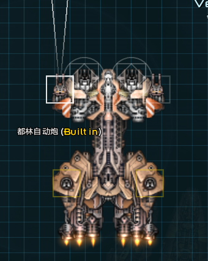
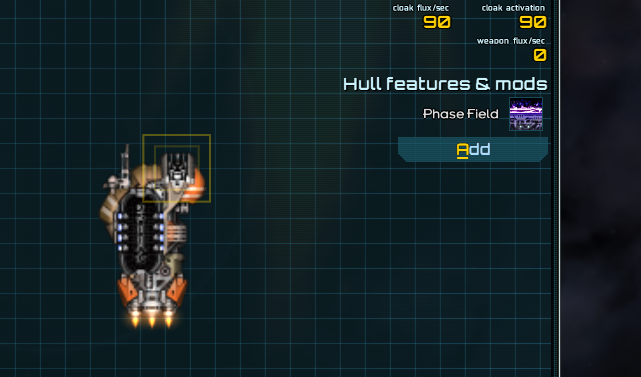
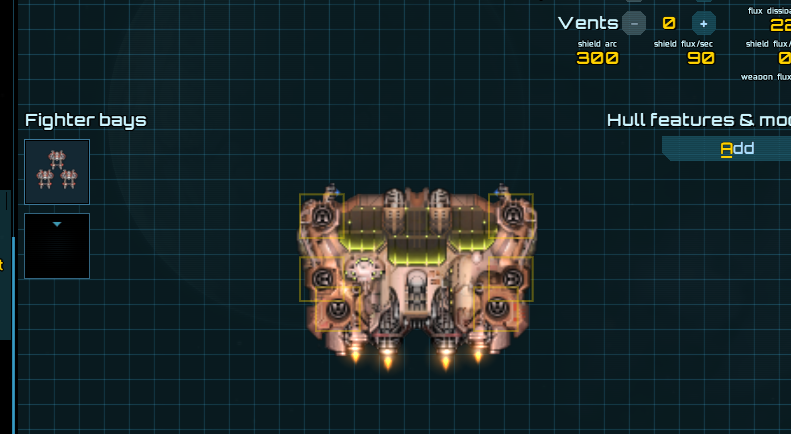

# 各类内置

*本节预期阅读时间：~3 分钟。*

*本节预期操作时间：~5 分钟。*

## 内置武器

为舰船加入内置武器的前期工作需要依赖于舰船编辑器，**因此编者建议您在设计舰船的时候就提前设计、设置好内置槽位**，后期修改会略显麻烦。

内置槽位在`.ship`文件中看上去大概是这样的：

```json {4,13}
    {
      "id": "WS0003",
      "size": "SMALL",
      "type": "BUILT_IN",
      "mount": "HARDPOINT",
      "arc": 10,
      "angle": 0,
      "locations": [59, 45]
    },
    {
      "id": "WS0004",
      "size": "SMALL",
      "type": "BUILT_IN",
      "mount": "HARDPOINT",
      "arc": 10,
      "angle": -0,
      "locations": [59, -45]
    },
```

增加内置武器建议手动打开`.ship`文件进行修改，但**能复制粘贴修改就不手写**。本例将对`GearIn_artizan.ship`加入两门内置武器。

从原版攻势的`onslaught.ship`文件中抄出如下内容：

```json
    "builtInWeapons": {
        "WS 016": "tpc",
        "WS 017": "tpc"
    },
```

修改为所需武器，**并反复确定槽位 ID 的正确**，然后插入所需的`.ship`文件内的对应位置：

```json {2,3}
    "builtInWeapons": {
        "WS0003": "GearIn_durin",
        "WS0004": "GearIn_durin"
    },
```



### 内置装饰性武器

装饰性武器的安装方式和通常的内置武器几乎完全一样，只是需要将槽位类型改为`DECORATIVE`即可。装饰武器不会出现在武器组或舰船数据列表中。

### 战机的内置武器？

战机**不应该**设置内置武器，而应该设置正常的槽位、在装配文件里设置武器。

::: danger 有什么不好？

对战机设置内置武器可能导致武器转速归零。

:::

## 内置插件

增加内置插件也建议手动打开`.ship`文件进行修改，但**能复制粘贴修改就不手写**。本例将对`GearIn_forging.ship`加入相位对应内插。

从原版阴影的`shade.ship`文件中抄出如下内容：

```json
    "builtInMods": [
        "phasefield",
        "delicate"
    ],
```

由于无需精密机械，因此简单修改后插入到`.ship`文件内的对应位置：

```json {2}
    "builtInMods": [
        "phasefield"
    ],
```



## 内置战机

增加内置战机也建议手动打开`.ship`文件进行修改，但**能复制粘贴修改就不手写**。本例将对`GearIn_furnaceman.ship`加入一甲板对应内置战机。

从原版暴雨的`tempest.ship`文件中抄出如下内容：

```json
"builtInWings": [
    "terminator_wing"
],
```

修改为所需的战机 ID 后插入到`.ship`文件内的对应位置：

```json {2}
"builtInWings": [
    "GearIn_slag_wing"
],
```


