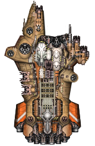

# 制作模块船

*本节预期阅读时间：~10 分钟。*

*本节预期操作时间：~20 分钟。*

## 制作模块部件

一艘模块船往往由至少 2 个模块组成。这些模块本身都是舰船，因此需要先准备好它们的贴图：



这艘`窑-级(Kiln)`巡洋舰的主体和模块分别由`狮鹫`与`苍鹭`简单修改而来，耗时不超过 20 秒。为它们分别分配`GearIn_kiln`和`GearIn_kiln_module`的舰船 ID。

然后安装正常舰船制作流程将它们的船体文件制作出：


::: tip 模块设置

如果情况合适，则模块可以不设置引擎。

但它依然必须设置护盾范围，哪怕它设计上无盾。

:::

注意主体要带有`STATION`型槽位，这是后续安装模块所需的槽位：


然后为本例中的部件制作数据：

```csv {19,20}
name,id,designation,tech/manufacturer,system id,fleet pts,hitpoints,armor rating,max flux,8/6/5/4%,flux dissipation,ordnance points,fighter bays,max speed,acceleration,deceleration,max turn rate,turn acceleration,mass,shield type,defense id,shield arc,shield upkeep,shield efficiency,phase cost,phase upkeep,min crew,max crew,cargo,fuel,fuel/ly,range,max burn,base value,cr %/day,CR to deploy,peak CR sec,CR loss/sec,supplies/rec,supplies/mo,c/s,c/f,f/s,f/f,crew/s,crew/f,hints,tags,rarity,breakProb,minPieces,maxPieces,travel drive,number
,,,,,,,,,,,,,,,,,,,,,,,,,,,,,,,,,,,,,,,,,,,,,,,,,,,,,
#Lasher,lasher,Frigate,Low Tech,ammofeed,5,1750,300,2100,1750,140,55,,120,110,90,60,90,200,FRONT,,210,0.4,1,,,25,50,40,25,1,25,10,9000,8,10,240,0.25,4,4,,,,,,,,"lowtech_bp, merc",,0.4,2,2,,204
,,,,,,,,,,,,,,,,,,,,,,,,,,,,,,,,,,,,,,,,,,,,,,,,,,,,,
#Hammerhead,hammerhead,Destroyer,Midline,ammofeed,10,5000,500,4200,4167,250,95,,90,60,40,30,60,400,FRONT,,300,0.4,0.8,,,50,100,100,60,2,30,9,40000,5,12,360,0.25,10,10,,,,,,,,"midline_bp, merc",,0.5,2,3,,300
,,,,,,,,,,,,,,,,,,,,,,,,,,,,,,,,,,,,,,,,,,,,,,,,,,,,,
#Eagle,eagle,Cruiser,Midline,maneuveringjets,14,8000,1000,11000,12000,600,155,,50,30,20,15,20,1200,FRONT,,270,0.4,0.8,,,150,250,150,100,3,33,8,120000,3,12,480,0.25,22,22,,,,,,,,"rare_bp, merc",,0.5,2,3,,401
,,,,,,,,,,,,,,,,,,,,,,,,,,,,,,,,,,,,,,,,,,,,,,,,,,,,,
#Conquest,conquest,Battlecruiser,Midline,maneuveringjets,24,12000,1200,20000,30000,1200,315,,45,20,15,6,4,2500,OMNI,,90,0.4,1.4,,,400,500,300,300,10,30,8,300000,3,15,600,0.25,40,40,,,,,,,,"rare_bp, merc",,0.5,2,4,,503
,,,,,,,,,,,,,,,,,,,,,,,,,,,,

炉渣,GearIn_slag,,未知,flarelauncher_fighter,,750,100,200,,100,0,,180,400,350,90,180,30,NONE,,0,0,0,,,1,1,,,,,,,,,,,,,,,,,,,,,,0,,,,104

锻件,GearIn_forging,相位护卫舰,未知,ammofeed,6,2000,350,1200,2000,100,35,,90,120,90,45,90,200,PHASE,phasecloak,90,,,0.075,0.075,4,10,10,20,1,20,9,26000,10,20,180,0.25,6,6,,,,,,,PHASE,GearIn_bp,,0.5,2,2,,228

工匠,GearIn_artizan,驱逐舰,未知,GearIn_assaultfeed,10,5000,500,3800,4167,200,95,,80,60,40,30,60,400,PHASE,GearIn_resistfield,,,,0.1,0,50,100,100,60,2,30,9,40000,5,12,360,0.25,10,10,,,,,,,,"GearIn_bp",,0.5,2,3,,300
看炉人,GearIn_furnaceman,轻型航母,未知,targetingfeed,11,4500,400,3000,2813,225,75,2,75,50,30,25,25,450,FRONT,,300,0.4,0.8,,,90,150,40,40,2,20,9,52000,5,15,360,0.25,13,13,,,,,,,CARRIER,"GearIn_bp",,0.5,2,3,,318

窑,GearIn_kiln,模块巡洋舰,Midline,GearIn_assaultfeed,15,10000,1250,10000,11000,500,165,,60,40,30,15,20,1500,FRONT,,210,0.4,0.8,,,200,300,150,150,4,38,8,125000,4,12,480,0.25,25,25,,,,,,,SHIP_WITH_MODULES,"GearIn_bp",,0.5,2,4,,401.5
,GearIn_kiln_module,模块,Midline,ammofeed,10,5000,500,3000,4167,250,60,,0,0,0,10,10,300,NONE,,0,0,0,,,0,0,0,0,1,,,40000,,1,360,0.25,0,0,,,,,,,"UNBOARDABLE, HIDE_IN_CODEX",,,0.5,2,3,,300
```

::: tip 模块的数据

模块的舰级名可以不填。

模块的后勤数据应当尽可能接近于“无”，且带有`UNBOARDABLE`和`HIDE_IN_CODEX`以避免问题。

**模块船的`hints`必须带有`SHIP_WITH_MODULES`，否则将在某些场合出现模块丢失**。

除此之外，它的`tags`不应该包含任何诸如`x_bp`或`merc`。

:::

## 组装模块船

此时进入测试战役，会发现主体没有模块，也无法在游戏内使用任何正常方法为它设置模块。**因为远行星号的模块舰制作极其别扭，必须要有一个`带模块的主体装配`**，这艘船才会默认带有模块。

使用测试战役分别为主体和模块制作一个装配：


然后放入您 MOD 的`data/variants`文件夹中，修改文件名和内部的 variantId 等参数：


然后打开原版的`data\variants\stations`文件夹，打开`station_small_Standard.variant`。您应该能发现诸如这样的一段：

```json
    "modules": {
        "WS 001": "platform1_Standard",
        "WS 002": "platform1_Standard",
        "WS 003": "platform1_Standard",
        "WS 004": "platform1_Standard"
    }
```

这就是模块在装配文件的设置方案。将它略加修改后，插入到本例的`GearIn_kiln_combat.variant`文件中：

```json {15-18}
{
    "displayName": "Combat",
    "fluxCapacitors": 23,
    "fluxVents": 30,
    "hullId": "GearIn_kiln",
    "hullMods": [
        "heavyarmor",
        "auxiliarythrusters",
        "targetingunit"
    ],
    "permaMods": [],
    "sMods": [],
    "variantId": "GearIn_kiln_combat",
    "goalVariant": true,
    "modules": {
        # 注意槽位 ID       模块的 装配 ID
        "MODULE_0": "GearIn_kiln_module_combat"
    },
    "weaponGroups": [
        {
            "autofire": false,
            "mode": "LINKED",
            "weapons": {
                "WS0004": "GearIn_durin",
                "WS0005": "GearIn_durin",
                "WS0011": "GearIn_durin"
            }
        },
        {
            "autofire": false,
            "mode": "ALTERNATING",
            "weapons": {
                "WS0006": "sabotpod",
                "WS0007": "sabotpod"
            }
        },
        {
            "autofire": true,
            "mode": "LINKED",
            "weapons": {"WS0001": "heavyac"}
        },
        {
            "autofire": true,
            "mode": "LINKED",
            "weapons": {
                "WS0002": "vulcan",
                "WS0003": "vulcan",
                "WS0008": "vulcan",
                "WS0009": "vulcan",
                "WS0010": "vulcan"
            }
        }
    ]
}
```

`窑-级`模块巡洋舰现在默认带有模块了。


### 实用模块 tags 速查表

| 英文                 | 实际意义                     |
| -------------------- | ---------------------------- |
| module_unselectable  | 模块无法被选中               |
| module_refit_bright  | 模块在装配界面时不会默认暗下 |
| module_no_status_bar | 模块在战斗中不显示状态属性条 |
| module_hull_bar_only | 模块在战斗中不显示幅能属性条 |

此外，装配点上限为 0 的模块默认无法在装配界面被选中。
